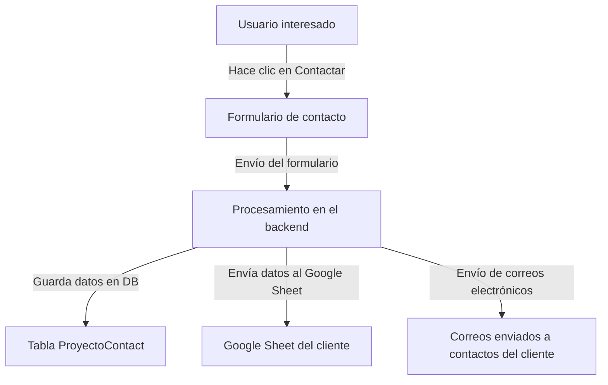

# Documento Funcional: Agregar Google Sheet a un Proyecto Inmobiliario

---

## 1. Resumen
**Descripción:**  
Este flujo permite agregar un Google Sheet como repositorio externo para almacenar información de contactos interesados en un proyecto inmobiliario. Los datos del formulario de contacto llenados por los interesados se envían directamente al Google Sheet configurado.

**Propósito:**  
Brindar a los clientes una solución centralizada y accesible para gestionar sus leads, integrando sus propios recursos externos como Google Sheets.

---

## 2. Requerimiento Funcional
**ID:** `RF013`  
**Nombre del Requerimiento:** Agregar Google Sheet a un Proyecto Inmobiliario.  

**Descripción:**  
El sistema debe permitir habilitar y configurar un Google Sheet para cada proyecto inmobiliario desde el panel administrativo en Filament. Cuando un interesado llena el formulario de contacto, la información se almacena tanto en la base de datos del sistema como en el Google Sheet del cliente.

**Reglas de Negocio:**
1. El cliente debe proporcionar acceso de edición al Google Sheet a través del correo electrónico de la cuenta de servicio de Google.
2. Los interesados deben aceptar los términos y condiciones antes de enviar el formulario de contacto.
3. La funcionalidad de Google Sheet debe estar habilitada para el proyecto desde el panel administrativo.

---

## 3. Flujo

1. Un interesado llena el formulario de contacto del proyecto en la interfaz web.
2. El sistema valida la información ingresada en el formulario.
3. La información se guarda en la tabla `proyecto_contacts`.
4. Si el proyecto tiene habilitado Google Sheet, los datos del contacto se envían al Google Sheet configurado.
5. Se envía un correo electrónico a cada contacto registrado para el cliente del proyecto inmobiliario. Este correo incluye la información del contacto interesado y detalles adicionales del proyecto.
6. El sistema responde al interesado indicando el éxito del envío o mostrando errores si los hubiere.

---

## 4. Artefactos Técnicos Relacionados

| Artefacto Técnico                   | Descripción                                                                 |
|------------------------------------------|---------------------------------------------------------------------------------|
| **Formulario de contacto**               | HTML con campos básicos como nombre, correo, teléfono y mensaje.               |
| **Tabla `proyecto_contacts`**            | Almacena la información de contactos interesados en proyectos.                 |
| **Tabla `proyecto_cliente_sheets`**      | Almacena la configuración del Google Sheet de cada proyecto.                   |
| **Método `sendToGoogleSheet`**           | Envía los datos capturados al Google Sheet configurado.                        |
| **Cuenta de Servicio de Google**         | Configuración necesaria para autenticarse y manipular el Google Sheet.         |
| **Panel Administrativo en Filament**     | Interfaz para habilitar y configurar el Google Sheet de un proyecto.           |

---

## 5. Historial de Cambios

| Versión | Fecha       | Cambios Realizados             | Autor         |
|-------------|-----------------|---------------------------------------|-------------------|
| v1.0        | 11/12/2024     | Documento funcional inicial creado.   | Walker Alfaro     |
