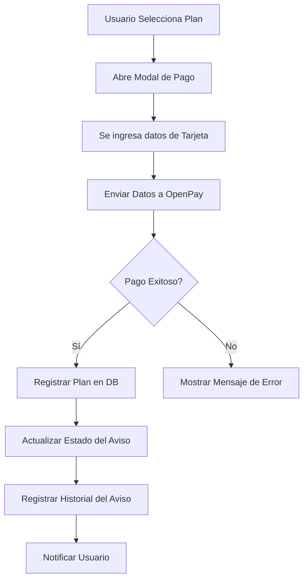

# Documento Funcional: Pago para Propietarios, Acreedores y Corredores

---

## 1. Resumen
**Descripción:**  
Este flujo permite a los usuarios (propietarios, acreedores y corredores) seleccionar y pagar un plan para publicar inmuebles en la plataforma. La integración con OpenPay facilita los pagos mediante tarjetas de crédito o débito.

**Propósito:**  
Proveer un sistema intuitivo para que los usuarios puedan adquirir planes de publicación y garantizar una experiencia de pago segura y eficiente.

---

## 2. Requerimiento Funcional
**ID:** `RF010`
**Nombre del Requisito:** Gestión de Planes y Procesamiento de Pagos  

**Descripción:**  
El sistema debe permitir a los usuarios adquirir un plan de publicación mediante pagos en línea y asociarlo a sus avisos. Debe registrar las transacciones, manejar la asignación de avisos según el plan y mantener la trazabilidad de los estados de los avisos.

**Reglas de Negocio:**  
1. Sólo los usuarios autenticados pueden adquirir planes.
2. Un usuario puede adquirir múltiples planes, pero los avisos deben respetar las limitaciones de cada plan (número de anuncios permitidos, tipo de anuncio, duración).
3. Los pagos deben procesarse exclusivamente a través de OpenPay.
4. Los planes tienen una fecha de inicio y de fin definidas al momento de la compra.

---

## 3. Flujo

### Flujo General:
1. **Selección del Plan:**
   - El usuario accede a la sección de planes desde su perfil.
   - Revisa las características de los planes disponibles y selecciona uno.
2. **Configuración del Pago:**
   - El sistema abre un modal para que el usuario ingrese los datos de su tarjeta.
   - Las credenciales de OpenPay se configuran dinámicamente.
3. **Procesamiento del Pago:**
   - Los datos del pago se envían a OpenPay.
   - OpenPay procesa la transacción y devuelve la respuesta.
4. **Asignación del Plan:**
   - Si el pago es exitoso, el sistema asocia el plan al usuario.
   - El aviso se publica y su estado cambia a "publicado".
   - Se registra el historial del aviso y los cambios en las tablas correspondientes.
5. **Notificaciones:**
   - El usuario recibe una notificación en la plataforma (Toast).
   - Se envía un correo electrónico confirmando la transacción y los detalles del aviso publicado.

---

### Diagrama de Flujo:

---

## 4. Artefactos Técnicos Relacionados

| **Artefacto Técnico**                   | **Descripción**                                             |
|-----------------------------------------|-------------------------------------------------------------|
| Tabla `users`                           | Almacena los datos del usuario que realiza el pago.         |
| Tabla `plans`                           | Contiene los detalles de los planes disponibles.            |
| Tabla `plan_user`                       | Registra la relación entre los usuarios y los planes.       |
| Tabla `avisos`                          | Contiene los detalles de los inmuebles publicados.          |
| Tabla `transacciones`                   | Registra las transacciones realizadas por los usuarios.     |
| Controlador `PlanController`            | Implementa la lógica de negocio para procesar pagos y planes. |
| Vista `planes.blade.php`                | Pantalla para seleccionar un plan.                         |
| Vista `pay-modal.blade.php`             | Modal para ingresar datos de pago.                         |
| Integración con OpenPay                 | Procesa los pagos con tarjetas de crédito o débito.         |

---

## 5. Historial de Cambios

| **Versión** | **Fecha**     | **Cambios Realizados**                | **Autor**         |
|-------------|---------------|----------------------------------------|-------------------|
| v1.0        | 06/12/2024    | Documento funcional inicial creado.    | Walker Alfaro     |
