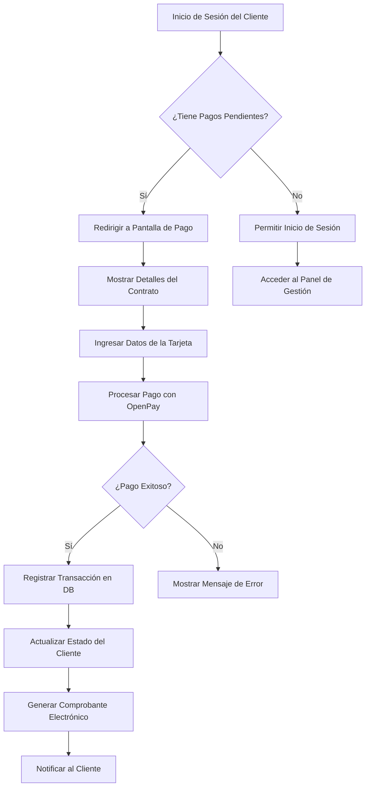

# Documento Funcional: Pago de Proyectos Inmobiliarios

---

## 1. Resumen
**Descripción:**  
Este flujo permite a los clientes de proyectos inmobiliarios realizar pagos asociados a contratos. Los pagos pueden ser únicos o fraccionados, y se procesan de forma segura utilizando OpenPay.

**Propósito:**  
Facilitar el pago de contratos de proyectos inmobiliarios, garantizar la trazabilidad de las transacciones y permitir a los clientes cumplir con sus obligaciones financieras de manera eficiente.

---

## 2. Requerimiento Funcional
**ID:** `RF011`  
**Nombre del Requisito:** Gestión y Procesamiento de Pagos para Proyectos Inmobiliarios  

**Descripción:**  
El sistema debe permitir a los clientes de proyectos inmobiliarios realizar pagos en línea, registrar las transacciones y emitir comprobantes electrónicos. Además, debe manejar pagos fraccionados y únicos según las condiciones del contrato.

**Reglas de Negocio:**  
1. Los clientes con pagos pendientes deben ser redirigidos automáticamente al flujo de pago.
2. Los pagos pueden ser únicos o fraccionados según las condiciones del contrato.
3. Los pagos se procesan exclusivamente mediante OpenPay.
4. Los clientes no pueden realizar pagos adicionales si ya están al día con sus obligaciones financieras.

---

## 3. Flujo

### Flujo General:
1. **Inicio de Sesión:**
   - El cliente inicia sesión en el sistema.
   - Si tiene pagos pendientes, se redirige automáticamente a la pantalla de pago.
2. **Validación del Estado del Cliente:**
   - El sistema verifica si el cliente tiene deudas pendientes.
   - Si está al día, no se permite realizar un pago.
3. **Visualización de los Detalles del Contrato:**
   - El cliente revisa los detalles de su contrato, incluyendo el monto y la fecha límite de pago.
4. **Ingreso de Datos de Pago:**
   - El cliente ingresa los datos de su tarjeta en el formulario de pago.
5. **Procesamiento del Pago:**
   - El sistema registra al cliente en OpenPay.
   - Tokeniza la tarjeta y procesa el débito correspondiente.
6. **Registro y Notificación:**
   - Se registra la transacción en la base de datos.
   - Se genera un comprobante electrónico.
   - El cliente recibe una notificación en la plataforma y por correo electrónico.

---

### Diagrama de Flujo (Mermaid):

---

## 4. Artefactos Técnicos Relacionados

| **Artefacto Técnico**                      | **Descripción**                                             |
|--------------------------------------------|-------------------------------------------------------------|
| Tabla `proyecto_clientes`                  | Almacena información de los clientes de proyectos.          |
| Tabla `proyecto_cronograma_pagos`          | Registra los pagos fraccionados asociados a los contratos.  |
| Tabla `transacciones`                      | Registra las transacciones de pago realizadas.              |
| Controlador `PlanController`               | Implementa la lógica del procesamiento de pagos.            |
| Vista `proyecto-pago.blade.php`            | Pantalla donde el cliente realiza el pago.                  |
| Integración con OpenPay                    | Maneja la creación de clientes, tokenización de tarjetas y pagos. |

---

## 5. Historial de Cambios

| **Versión** | **Fecha**     | **Cambios Realizados**                | **Autor**         |
|-------------|---------------|----------------------------------------|-------------------|
| v1.0        | 06/12/2024    | Documento funcional inicial creado.    | Walker Alfaro     |
