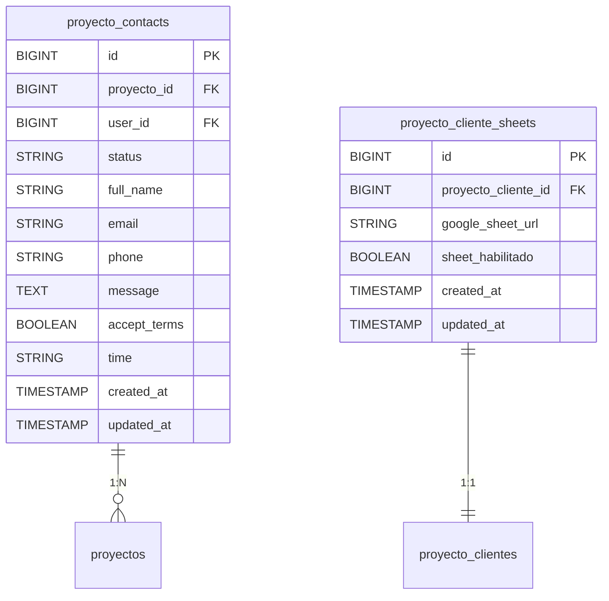

# Documento Técnico: Agregar Google Sheet a un Proyecto Inmobiliario

---

## 1. Resumen
**Descripción:**  
Esta funcionalidad permite configurar un Google Sheet como herramienta externa para gestionar leads de proyectos inmobiliarios. Los datos del formulario de contacto se envían automáticamente al Google Sheet habilitado.

**Propósito:**  
Facilitar la integración de recursos externos para la gestión de leads y ofrecer una solución más práctica y centralizada para los clientes.

---

## 2. Requisitos Funcionales Relacionados

| **ID**   | **Nombre del Requisito**                     | **Descripción**                                    |
|----------|----------------------------------------------|--------------------------------------------------|
| `RF013`  | Agregar Google Sheet a un Proyecto           | Configuración de un Google Sheet para proyectos. |

---

## 3. Base de Datos Relacionada

### Tablas Implicadas

#### **Tabla: `proyecto_contacts`**
**Propósito:** Almacenar la información de contactos interesados en proyectos inmobiliarios.

| **Columna**        | **Tipo**         | **Descripción**                                    |
|--------------------|------------------|--------------------------------------------------|
| id                 | BIGINT           | Identificador único del contacto.                |
| proyecto_id        | BIGINT           | Relación con la tabla `proyectos`.               |
| user_id            | BIGINT           | Relación con la tabla `users`.                   |
| status             | STRING           | Estado del contacto.                             |
| full_name          | STRING           | Nombre completo del contacto.                    |
| email              | STRING           | Correo electrónico del contacto.                |
| phone              | STRING           | Teléfono del contacto.                           |
| message            | TEXT             | Mensaje enviado por el interesado.              |
| accept_terms       | BOOLEAN          | Aceptación de términos y condiciones.           |
| time               | STRING           | Horario preferido de contacto.                  |
| created_at         | TIMESTAMP        | Fecha de creación del registro.                 |
| updated_at         | TIMESTAMP        | Fecha de actualización del registro.            |

#### **Tabla: `proyecto_cliente_sheets`**
**Propósito:** Configurar y habilitar Google Sheet para proyectos inmobiliarios.

| **Columna**         | **Tipo**         | **Descripción**                                  |
|---------------------|------------------|------------------------------------------------|
| id                  | BIGINT           | Identificador único del registro.              |
| proyecto_cliente_id | BIGINT           | Relación con la tabla `proyecto_clientes`.     |
| google_sheet_url    | STRING           | URL del Google Sheet configurado.              |
| sheet_habilitado    | BOOLEAN          | Indica si el Google Sheet está habilitado.     |
| created_at          | TIMESTAMP        | Fecha de creación del registro.                |
| updated_at          | TIMESTAMP        | Fecha de actualización del registro.           |

---

## 4. Relación de Tablas



---

## 5. APIs y Scripts

1. **Ruta:** `/procesar-contacto-proyecto`  
   - **Descripción:** Procesa el formulario de contacto, almacena los datos en la base de datos y los envía al Google Sheet del cliente.
   - **Método:** `POST`

2. **Script de JS:**  
   - Gestiona el envío del formulario y la validación de los datos ingresados.

```javascript
document.getElementById('btn-enviar-form-single').addEventListener('click', (e) => handleContactForm(e, 'correo'));
```

---

## 6. Controladores

### Controlador: `MyPostsController`  

#### Método: `procesar_contacto_proyecto`
**Descripción:**  
Este método es el núcleo del proceso para gestionar contactos interesados en un proyecto inmobiliario. Realiza varias tareas, desde validar los datos del formulario hasta registrar el contacto en la base de datos, enviar correos electrónicos y actualizar un Google Sheet si está habilitado.


1. **Validación del formulario:**  
   Se ejecuta la función `validar_formulario_contacto` para verificar que los datos enviados desde el formulario cumplan con los requisitos especificados.  
   - Si la validación falla, se retorna un mensaje de error al frontend con detalles específicos.

2. **Recuperación del proyecto y su configuración:**  
   - Se busca el proyecto relacionado mediante el `proyecto_id` recibido en la solicitud.  
   - Se obtienen las siguientes propiedades del proyecto:  
     - **URL actual del proyecto:** para rastrear desde dónde provino el contacto.  
     - **Lista de contactos registrados del cliente:** para determinar a quién se enviarán los correos electrónicos.  
     - **Configuración de Google Sheet:** para verificar si está habilitado y disponible.  

3. **Registro del contacto en la base de datos:**  
   - Utiliza el método `updateOrCreate` para evitar duplicados. Si un contacto ya existe con el mismo `email` para el proyecto, se actualiza; de lo contrario, se crea uno nuevo.  
   - Los datos guardados incluyen nombre, correo, teléfono, mensaje, tiempo de contacto preferido y la aceptación de términos.  

4. **Determinación de la acción:**  
   - Si el usuario eligió contactar vía **WhatsApp**, simplemente se retorna un mensaje de éxito para que el frontend lo maneje.  
   - Si el usuario eligió **correo electrónico**, se inicia el envío de correos electrónicos.

5. **Envío de correos electrónicos:**  
   - Se envía un correo a cada contacto asociado al cliente del proyecto.  
   - Los correos se copian (CC) a un equipo de soporte y se ocultan (BCC) a un correo interno para monitoreo.

6. **Envío a Google Sheet (si está habilitado):**  
   - Si el proyecto tiene un Google Sheet habilitado, se envían los datos del contacto al archivo configurado.  
   - Se llama al método `sendToGoogleSheet` con la URL del Google Sheet y los datos del contacto.

7. **Respuesta al cliente:**  
   - Finalmente, se envía una respuesta JSON con los detalles del contacto recién creado y un mensaje de éxito.

---

#### Método: `sendToGoogleSheet`
**Descripción:**  
Este método es responsable de enviar los datos del contacto a un archivo de Google Sheet del cliente si esta funcionalidad está habilitada. Utiliza la API de Google Sheets para realizar esta operación.

1. **Configuración del cliente de Google Sheets:**  
   - Se inicializa un cliente con las credenciales almacenadas en el archivo `.env`. Estas credenciales corresponden a la cuenta de servicio de Google creada específicamente para la integración.

2. **Extracción del ID del Google Sheet:**  
   - A partir de la URL del Google Sheet proporcionada, se extrae el ID del archivo mediante una expresión regular. Este ID es necesario para interactuar con la API de Google Sheets.

3. **Acceso a la hoja de cálculo:**  
   - Se accede al archivo de Google Sheet mediante su ID.  
   - Se selecciona la primera hoja (o pestaña) disponible en el archivo. Esta hoja será el destino de los datos.

4. **Preparación de los datos:**  
   - Los datos del contacto (nombre, correo, teléfono, mensaje, fecha y hora de contacto) se organizan en un formato adecuado para Google Sheets.

5. **Envío de los datos:**  
   - Se utiliza el método `append` de la API para agregar los datos como una nueva fila en la hoja de cálculo.  
   - Se asegura que los datos se ingresen de manera "RAW" (sin ningún formato especial).

6. **Manejo de errores:**  
   - Si ocurre algún error durante el envío, se lanza una excepción para manejarlo adecuadamente en el proceso principal.

---

**Relación entre los métodos:**  
El método `procesar_contacto_proyecto` se encarga de toda la lógica de negocio principal, mientras que `sendToGoogleSheet` maneja específicamente la integración con Google Sheets. Ambos trabajan en conjunto para garantizar que los contactos interesados se procesen correctamente y se registren en todas las plataformas necesarias.

---

## 7. Configuración del Formulario de Google Sheet en Filament

**Descripción:**  
El formulario de administración en Filament incluye una sección específica para configurar la integración con Google Sheets para cada proyecto inmobiliario. Esta configuración permite habilitar o deshabilitar la integración y proporcionar la URL del Google Sheet correspondiente. A continuación, se describe la funcionalidad de cada campo y su interacción.


#### Sección: Configuración de Google Sheet
- **Propósito:**  
  Proporcionar una interfaz administrativa para configurar la integración de Google Sheets en cada proyecto inmobiliario. Esto incluye la habilitación de la funcionalidad y la especificación de la URL del Google Sheet.

---

#### Componentes del Formulario

1. **Toggle: `Habilitar Google Sheet`**
   - **Descripción:**  
     Un botón de activación/desactivación que permite habilitar o deshabilitar la integración con Google Sheets para el proyecto actual.
   - **Detalles técnicos:**
     - **Propiedad reactiva:**  
       El campo de la URL (`google_sheet_url`) está deshabilitado por defecto. Solo se activa cuando el toggle está en estado "habilitado".
     - **Estilo:**  
       Utiliza un color verde ("success") cuando está habilitado.
     - **Valor predeterminado:**  
       Está desactivado (`false`) al inicializar el formulario.
   - **Uso:**  
     Los administradores pueden decidir si un proyecto debe usar Google Sheets.

2. **Campo de Texto: `URL de Google Sheet`**
   - **Descripción:**  
     Campo para introducir la URL del Google Sheet proporcionada por el cliente.
   - **Detalles técnicos:**
     - **Validación:**  
       El campo acepta solo URLs válidas y utiliza un marcador de posición que indica el formato correcto (`https://docs.google.com/spreadsheets/...`).
     - **Desactivación condicional:**  
       Este campo permanece deshabilitado hasta que el toggle `Habilitar Google Sheet` esté activado.
     - **Reactivo:**  
       Cambia su estado dinámicamente en función del valor del toggle.
   - **Uso:**  
     Los administradores deben pegar aquí la URL del Google Sheet configurado para el cliente del proyecto inmobiliario.

---

#### Funcionamiento General
1. **Habilitación de la integración:**
   - Al activar el toggle `Habilitar Google Sheet`, se desbloquea el campo de texto para ingresar la URL del Google Sheet. Esto permite asociar un Google Sheet específico al proyecto.

2. **Deshabilitación de la integración:**
   - Si el toggle está desactivado, la URL previamente ingresada queda inhabilitada y no se utilizará en el procesamiento de contactos.

3. **Persistencia de datos:**
   - Los valores del toggle (`sheet_habilitado`) y la URL (`google_sheet_url`) se guardan en la tabla `proyecto_cliente_sheets`.

---

#### Ventajas de la Implementación
- **Modularidad:**  
  La sección está vinculada a la relación `googleSheet` del modelo `ProyectoCliente`, lo que asegura una integración clara y directa con la base de datos.
- **Experiencia de usuario:**  
  La configuración reactiva proporciona un flujo intuitivo para los administradores, evitando la introducción de datos cuando la funcionalidad está deshabilitada.
- **Flexibilidad:**  
  Permite a los administradores habilitar o deshabilitar la integración según las necesidades del cliente.

Esta configuración es fundamental para garantizar que solo los proyectos que realmente requieren la integración con Google Sheets utilicen esta funcionalidad.

---

## 8. Historial de Cambios

| **Versión** | **Fecha**       | **Cambios Realizados**           | **Autor**              |
|-------------|-----------------|----------------------------------|------------------------|
| v1.0        | 11/12/2024      | Documento técnico inicial creado | Walker Alfaro          |