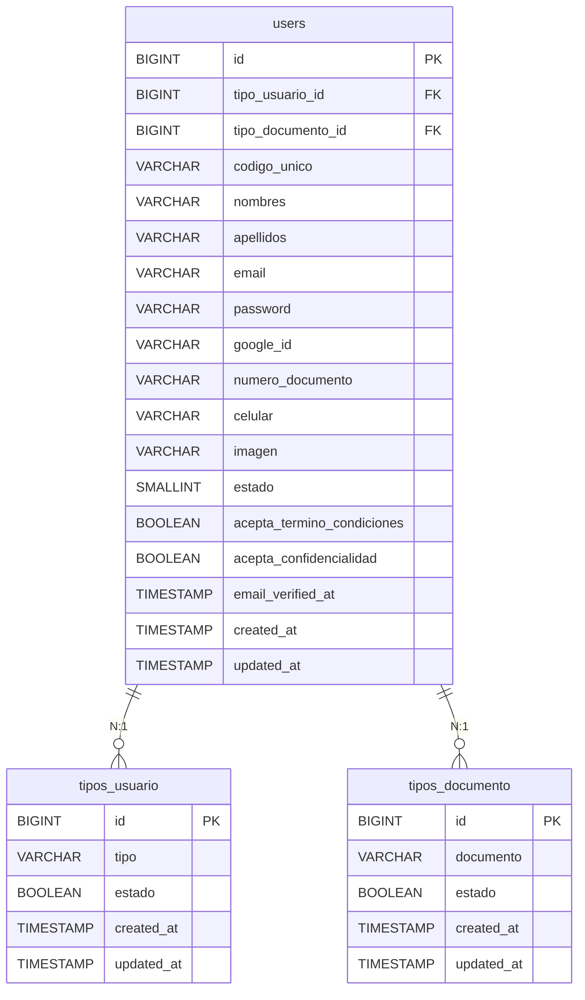

# Documento Técnico: Iniciar Sesión

## 1. Resumen

**Descripción:**  
El inicio de sesión permite a los usuarios autenticarse en el sistema utilizando sus credenciales (correo electrónico y contraseña). El sistema gestiona distintos perfiles: propietario, corredor y acreedor. Además, se valida el estado del usuario, como los pagos pendientes o el tipo de inicio de sesión (manual o externo).

**Propósito:**  
Garantizar un acceso seguro y personalizado a la plataforma, controlando el flujo según el tipo de usuario y su estado actual.

---

## 2. Requisitos Funcionales Relacionados

| **ID**   | **Nombre del Requisito**        | **Descripción**                                 |
|----------|---------------------------------|------------------------------------------------|
| `RF003`  | Iniciar sesión                 | Permitir a los usuarios autenticarse con sus credenciales. |

---

## 3. Base de Datos Relacionada

### Tablas Implicadas

### Tabla: `users`

#### Descripción Actualizada:
La tabla `users` contiene la información principal de los usuarios de la plataforma. Incluye campos necesarios para la autenticación, datos personales, preferencias de privacidad, y asociaciones con otros modelos relevantes.

| **Columna**                | **Tipo**         | **Descripción**                                                                 |
|----------------------------|------------------|---------------------------------------------------------------------------------|
| id                         | BIGINT           | Identificador único del usuario.                                               |
| tipo_usuario_id            | BIGINT (FK)      | Relación con la tabla `tipos_usuario`, que determina el perfil del usuario.     |
| not_pay                    | BOOLEAN          | Indica si el usuario tiene pagos pendientes (0: no, 1: sí).                    |
| codigo_unico               | VARCHAR(200)     | Código único asociado al usuario, usado para identificaciones específicas.      |
| nombres                    | VARCHAR(200)     | Nombre del usuario.                                                            |
| apellidos                  | VARCHAR(200)     | Apellidos del usuario.                                                         |
| email                      | VARCHAR(150)     | Correo electrónico único para cada usuario.                                    |
| password                   | VARCHAR(255)     | Contraseña hash del usuario. Puede ser `null` para usuarios con inicio externo. |
| google_id                  | VARCHAR(255)     | ID de Google para usuarios creados mediante inicio de sesión externo.          |
| tipo_documento_id          | BIGINT (FK)      | Relación con la tabla `tipos_documento`, que define el tipo de documento.       |
| numero_documento           | VARCHAR(50)      | Número de documento asociado al usuario.                                       |
| celular                    | VARCHAR(15)      | Número de teléfono del usuario.                                                |
| imagen                     | VARCHAR(250)     | URL de la imagen de perfil del usuario.                                        |
| estado                     | SMALLINT         | Estado del usuario (1: activo, 0: inactivo).                                    |
| acepta_termino_condiciones | BOOLEAN          | Indica si el usuario aceptó los términos y condiciones de uso (1: sí, 0: no).  |
| acepta_confidencialidad    | BOOLEAN          | Indica si el usuario aceptó las políticas de confidencialidad (1: sí, 0: no).  |
| email_verified_at          | TIMESTAMP        | Fecha y hora en que el correo fue verificado.                                   |
| remember_token             | VARCHAR(100)     | Token para la funcionalidad de "recuérdame".                                   |
| created_at                 | TIMESTAMP        | Fecha y hora de creación del registro.                                         |
| updated_at                 | TIMESTAMP        | Fecha y hora de la última actualización del registro.                          |

#### Tabla: `tipos_documento`

**Propósito:**
La tabla `tipos_documento` almacena los diferentes tipos de documentos que pueden ser asignados a los usuarios, tales como DNI, pasaporte, carnet de extranjería, entre otros.

| **Columna**   | **Tipo**     | **Descripción**                                                     |
|---------------|--------------|---------------------------------------------------------------------|
| id            | BIGINT       | Identificador único del tipo de documento.                         |
| documento     | VARCHAR(150) | Nombre o descripción del tipo de documento (e.g., "DNI").          |
| estado        | BOOLEAN      | Indica si el tipo de documento está activo (1: activo, 0: inactivo). |
| created_at    | TIMESTAMP    | Fecha y hora de creación del registro.                             |
| updated_at    | TIMESTAMP    | Fecha y hora de la última actualización del registro.              |

---

#### Tabla: `tipos_usuario`

**Propósito:**
La tabla `tipos_usuario` define los roles asignables a los usuarios en la plataforma, como propietarios, corredores o acreedores.

| **Columna**   | **Tipo**     | **Descripción**                                                     |
|---------------|--------------|---------------------------------------------------------------------|
| id            | BIGINT       | Identificador único del tipo de usuario.                           |
| tipo          | VARCHAR(150) | Nombre o descripción del tipo de usuario (e.g., "Propietario").    |
| estado        | BOOLEAN      | Indica si el tipo de usuario está activo (1: activo, 0: inactivo). |
| created_at    | TIMESTAMP    | Fecha y hora de creación del registro.                             |
| updated_at    | TIMESTAMP    | Fecha y hora de la última actualización del registro.   

#### Relación de Llaves Foráneas:
- **`tipo_usuario_id`:** Relaciona al usuario con su perfil definido en `tipos_usuario`.
- **`tipo_documento_id`:** Relaciona al usuario con el tipo de documento almacenado en `tipos_documento`.

#### Cambios Recientes:
1. **Incorporación del Campo `not_pay`:**
   - Propósito: Indicar si el usuario tiene pagos pendientes.
   - Tipo: `BOOLEAN`.
   - Valor por defecto: `0` (sin pagos pendientes).
   
2. **Detalles de Contraseña y Google ID:**
   - La columna `password` puede ser `null` para usuarios creados mediante inicio de sesión externo.
   - Se agregó el campo `google_id` para almacenar el identificador del usuario en Google.

#### Relaciones:



Esta estructura relacional permite que cada usuario esté asociado a un tipo de documento y un tipo de usuario específico, proporcionando flexibilidad y organización en la gestión de usuarios.


---

## 5. APIs y Scripts

### **API de Inicio de Sesión**
- **Endpoint:** `POST /login`
- **Método:** `LoginController@login`
- **Propósito:**  
  Procesar las credenciales ingresadas por el usuario, validar los datos y autenticar al usuario en el sistema.

### **Scripts de Frontend**
1. **Formulario de inicio de sesión:**  
   El formulario envía las credenciales mediante una solicitud `POST` al backend, incluyendo:
   - `correo`: Correo electrónico del usuario.
   - `contraseña`: Contraseña del usuario.

2. **Validación y Redirección:**  
   - Si la autenticación es exitosa, el usuario es redirigido a su panel correspondiente.
   - Si hay un error (como credenciales incorrectas), el formulario muestra un mensaje de error.

---

## 6. Controladores

### **Método: LoginController@login**
Este método realiza la autenticación del usuario mediante varios pasos:

1. **Validación Inicial:**
   - Se valida que los campos `user_type`, `correo`, y `contraseña` sean proporcionados correctamente.
   - Si la validación falla, se devuelve un error con los detalles.

2. **Búsqueda del Usuario:**
   - Se busca un registro en la tabla `users` que coincida con el correo proporcionado.
   - Si no existe un usuario con ese correo, se devuelve un error indicando que el correo no está registrado.

3. **Validación de Contraseña:**
   - Si el campo `password` del usuario está vacío o nulo, se asume que el usuario fue creado mediante un inicio de sesión externo (como Google).
   - Si el hash de la contraseña no coincide con la ingresada, se devuelve un error indicando que la contraseña es incorrecta.

4. **Validación de Tipo de Usuario y Estado:**
   - Si el usuario pertenece al tipo "acreedor" (`tipo_usuario_id == 5`), se realiza una validación adicional para verificar su estado de pago.
   - Si el usuario tiene pagos pendientes, se redirige al flujo de pagos y se almacenan los datos relevantes en la sesión.

5. **Autenticación Exitosa:**
   - Si todas las validaciones son correctas, el método autentica al usuario utilizando `Auth::login($user)`.
   - Finalmente, se redirige al panel correspondiente del usuario.

---

#### **Detalles Técnicos del Código**

1. **Validación del Formulario**
   ```php
   $validator = Validator::make($request->all(), [
       'user_type' => 'required|string',
       'correo' => 'required|email',
       'contraseña' => 'required',
   ]);
   if ($validator->fails()) {
       return response()->json([
           'message' => 'Errores de validación',
           'errors' => $validator->errors()
       ], 422);
   }
   ```

   - Este bloque asegura que los datos ingresados cumplan con los requisitos mínimos.
   - Si los datos no son válidos, el método detiene su ejecución y devuelve errores al frontend.

2. **Validación de Contraseña**
   ```php
   if (!Hash::check($request->input('contraseña'), $user->password)) {
       return response()->json([
           'message' => 'La contraseña es incorrecta.',
           'errors' => [
               'contraseña' => ['La contraseña es incorrecta.']
           ]
       ], 422);
   }
   ```

   - Se utiliza `Hash::check` para comparar la contraseña ingresada con el hash almacenado en la base de datos.
   - Esto garantiza que las contraseñas no se almacenen en texto plano.

3. **Manejo de Usuarios Acreedores**
   ```php
   if ($user->tipo_usuario_id == 5) {
       $proyectoCliente = ProyectoCliente::join('proyecto_planes_activos', 'proyecto_clientes.id', '=', 'proyecto_planes_activos.proyecto_cliente_id')
           ->where('proyecto_clientes.user_id', $user->id)
           ->where('proyecto_planes_activos.fecha_inicio', '<=', Carbon::now())
           ->where('proyecto_planes_activos.fecha_fin', '>=', Carbon::now())
           ->orderBy('proyecto_planes_activos.fecha_inicio', 'desc')
           ->first();
       if (!$proyectoCliente->al_dia) {
           session([...]); // Guardar datos en sesión
           return response()->json([...], 200);
       }
   }
   ```

   - Este bloque verifica si un usuario de tipo "acreedor" tiene pagos pendientes. Si es así, se redirige al flujo de pagos.

4. **Inicio de Sesión y Redirección**
   ```php
   Auth::login($user);
   return response()->json([
       'message' => 'Inicio de sesión exitoso.',
       'redirect' => redirect()->intended(route('panel.mis-avisos'))->getTargetUrl(),
   ]);
   ```

   - El método `Auth::login` autentica al usuario.
   - Luego, se redirige al panel de administración o la página deseada.

---

## 7. Historial de Cambios

| **Versión** | **Fecha**       | **Cambios Realizados**           | **Autor**              |
|-------------|-----------------|----------------------------------|------------------------|
| v1.0        | 12/12/2024      | Documento técnico inicial creado | Walker Alfaro          |
