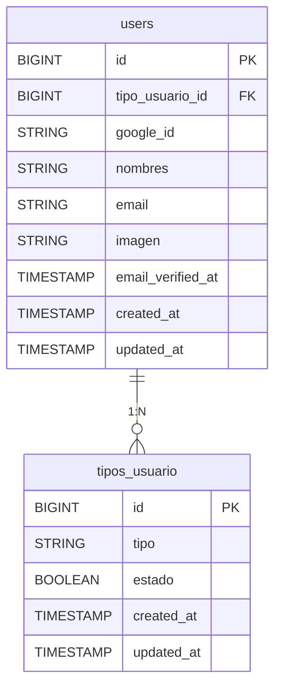

# Documento Técnico: Iniciar Sesión con Google

---

## 1. Resumen

**Descripción:**  
Este flujo permite a los usuarios iniciar sesión en el sistema utilizando su cuenta de Google. Es una alternativa eficiente que elimina la necesidad de recordar contraseñas o completar formularios de registro, haciendo uso de la API de Google para autenticación.  

**Propósito:**  
Facilitar y agilizar el proceso de inicio de sesión para mejorar la experiencia del usuario y aumentar la tasa de retención en la plataforma.

---

## 2. Requisitos Funcionales Relacionados

| **ID**   | **Nombre del Requisito**                | **Descripción**                                    |
|----------|-----------------------------------------|--------------------------------------------------|
| `RF004`  | Iniciar sesión con Google               | Permitir a los usuarios iniciar sesión mediante su cuenta de Google. |

---

## 3. Base de Datos Relacionada

### Tablas Implicadas

#### Tabla: `users`
**Propósito:**  
Almacena los datos de los usuarios, incluyendo información básica, tipo de usuario y datos necesarios para su autenticación.

| **Columna**             | **Tipo**     | **Descripción**                                                                 |
|-------------------------|--------------|---------------------------------------------------------------------------------|
| id                      | BIGINT       | Identificador único del usuario.                                               |
| tipo_usuario_id         | BIGINT       | Relación con la tabla `tipos_usuario` para identificar el perfil del usuario.  |
| google_id               | STRING       | Identificador único asignado por Google para el usuario.                       |
| nombres                 | STRING       | Nombre del usuario registrado en Google.                                       |
| email                   | STRING       | Dirección de correo electrónico del usuario.                                   |
| imagen                  | STRING       | URL de la imagen de perfil del usuario proporcionada por Google.               |
| email_verified_at       | TIMESTAMP    | Fecha y hora de verificación del correo electrónico.                           |
| created_at              | TIMESTAMP    | Fecha y hora de creación del registro.                                         |
| updated_at              | TIMESTAMP    | Fecha y hora de la última actualización del registro.                          |

---

## 4. Relación de Tablas

---

## 5. APIs y Scripts

### Dependencia Externa: Socialite  
Laravel Socialite facilita la integración con proveedores de OAuth, como Google. Los métodos clave en este flujo son:  
1. **`Socialite::driver('google')->with(['prompt' => 'select_account'])->redirect()`**  
   Redirige al usuario a la página de autenticación de Google, donde seleccionará su cuenta.  
2. **`Socialite::driver('google')->user()`**  
   Recupera los datos del usuario autenticado desde Google, como su correo, nombre y avatar.

### Scripts Relacionados  
- El frontend contiene el botón que redirige a la ruta `/google-auth/redirect`, iniciando el proceso de autenticación.

---

## 6. Controladores

### `selectAccountGoogle()`
1. **Propósito:**  
   Redirigir al usuario a la página de autenticación de Google para seleccionar su cuenta.  

2. **Explicación del Flujo:**  
   - Este método utiliza `Socialite::driver('google')` para iniciar el flujo OAuth con Google.  
   - La opción `with(['prompt' => 'select_account'])` asegura que Google solicite al usuario seleccionar una cuenta, incluso si ya ha iniciado sesión en su navegador.  
   - Finalmente, redirige al usuario a la página de inicio de sesión de Google.

### `createLoginGoogle()`
1. **Propósito:**  
   Completar el proceso de inicio de sesión, verificando si el usuario existe en la base de datos o registrándolo si no lo está.

2. **Explicación del Flujo:**  
   - **Recuperar Datos del Usuario:**  
     Utiliza `Socialite::driver('google')->user()` para obtener información como `id`, `name`, `email`, y `avatar`.  

   - **Verificar Existencia del Usuario:**  
     Busca al usuario en la base de datos utilizando el `google_id` recibido.  
     - Si el usuario existe:  
       - Inicia sesión con `Auth::login($existingUser)`.  
       - Redirige al usuario a la página principal con sus datos cargados en sesión.  

     - Si el usuario no existe:  
       - Crea un nuevo registro en la tabla `users` con la información proporcionada por Google.  
       - Asigna un `tipo_usuario_id` predeterminado (por defecto, `2: corredor`).
       - Inicia sesión con `Auth::login($user)` y redirige al usuario a la página principal.  

   - **Manejo de Errores:**  
     Si ocurre algún error durante el proceso, se captura mediante un bloque `try-catch`, asegurando que el sistema no falle.

---

## 7. Historial de Cambios

| **Versión** | **Fecha**       | **Cambios Realizados**           | **Autor**              |
|-------------|-----------------|----------------------------------|------------------------|
| v1.0        | 03/12/2024      | Documento técnico inicial creado | Walker Alfaro          |
