# Documento Técnico: Pago de Proyectos Inmobiliarios

## 1. Resumen
**Descripción:** Este documento detalla el flujo técnico del sistema de pagos para proyectos inmobiliarios. El flujo incluye pagos iniciales (50%) o pagos únicos completos según el contrato (`pago_fraccionado` o `pago_unico`). Se utiliza OpenPay para procesar los pagos de manera segura.

---

## 2. Requisitos Funcionales Relacionados
- **RF002:** Permitir pagos mediante tarjeta de crédito/débito utilizando OpenPay.
- **RF003:** Registrar transacciones de pago asociadas a clientes de proyectos inmobiliarios.
- **RF004:** Generar comprobantes electrónicos tras el pago exitoso.

| **ID**   | **Nombre del Requisito**                 | **Descripción**                                    |
|----------|------------------------------------------|--------------------------------------------------|
| `RF011`    | Pago de Proyectos Inmobiliarios           | Permite pagos asociados a clientes de proyectos inmobiliarios |

---

## 3. Base de Datos Relacionada

### Tablas Implicadas

#### **Tabla: proyecto_clientes**
**Propósito:**  
Esta tabla almacena información detallada sobre los clientes asociados a proyectos inmobiliarios, incluyendo datos personales, condiciones del contrato y el estado del cliente respecto a sus pagos.

| **Columna**              | **Tipo**        | **Descripción**                                                   |
|---------------------------|-----------------|-------------------------------------------------------------------|
| id                       | BIGINT          | Identificador único del cliente del proyecto.                    |
| user_id                  | BIGINT          | Relación con la tabla `users`.                                    |
| razon_social             | VARCHAR(255)    | Nombre o razón social del cliente.                               |
| ruc                      | VARCHAR(20)     | Número de RUC del cliente.                                        |
| direccion_fiscal         | VARCHAR(255)    | Dirección fiscal del cliente.                                     |
| telefono_inmobiliaria    | VARCHAR(15)     | Teléfono de la inmobiliaria (opcional).                          |
| nombre_comercial         | VARCHAR(255)    | Nombre comercial del cliente (opcional).                         |
| representante_legal      | VARCHAR(255)    | Nombre del representante legal del cliente (opcional).           |
| direccion_representante  | VARCHAR(255)    | Dirección del representante legal (opcional).                    |
| nombre_contacto          | VARCHAR(255)    | Nombre del contacto principal.                                    |
| telefono_contacto        | VARCHAR(15)     | Teléfono del contacto principal.                                  |
| email_contacto           | VARCHAR(255)    | Correo electrónico del contacto principal.                       |
| fecha_inicio_contrato    | DATE            | Fecha de inicio del contrato.                                    |
| fecha_fin_contrato       | DATE            | Fecha de fin del contrato.                                        |
| numero_anuncios          | INTEGER         | Cantidad de anuncios incluidos en el plan.                       |
| habilitado               | BOOLEAN         | Indica si el cliente está habilitado.                            |
| activo                   | BOOLEAN         | Indica si el cliente está activo en el sistema.                  |
| vigente                  | BOOLEAN         | Indica si el contrato está vigente.                              |
| precio_plan              | DECIMAL(10,2)   | Precio total del plan contratado.                                |
| periodo_plan             | INTEGER         | Duración del plan en meses.                                       |
| pago_unico               | BOOLEAN         | Indica si el pago es único.                                       |
| pago_fraccionado         | BOOLEAN         | Indica si el pago es fraccionado.                                 |
| al_dia                   | BOOLEAN         | Indica si el cliente está al día con los pagos.                  |
| pagado                   | BOOLEAN         | Indica si el plan fue completamente pagado.                      |
| renovacion               | BOOLEAN         | Indica si el contrato es renovable.                              |
| contrato_url             | VARCHAR(255)    | URL del contrato en formato digital.                             |
| created_at               | TIMESTAMP       | Fecha de creación del registro.                                   |
| updated_at               | TIMESTAMP       | Fecha de última actualización del registro.                       |

#### **Tabla: proyecto_cronograma_pagos**
**Propósito:**  
Registra los pagos programados de clientes con opción de pago fraccionado, detallando fechas, montos y estados de cada pago.

| **Columna**           | **Tipo**          | **Descripción**                                   |
|-----------------------|-------------------|---------------------------------------------------|
| id                   | BIGINT            | Identificador único del cronograma de pago.      |
| proyecto_cliente_id  | BIGINT            | Relación con la tabla `proyecto_clientes`.        |
| fecha_programada     | DATE              | Fecha programada para el cobro.                  |
| monto                | DECIMAL(10, 2)    | Monto del pago programado.                       |
| estado               | ENUM              | Estado del pago (`pendiente`, `pagado`, etc.).    |
| intentos             | UNSIGNED INTEGER  | Número de intentos realizados para el cobro.     |
| reintento_hasta      | DATE              | Fecha límite para reintentos.                    |
| fecha_ultimo_intento | DATETIME          | Fecha del último intento de cobro.               |
| razon_fallo          | VARCHAR(255)      | Razón del fallo del cobro (si aplica).           |
| fallo_final          | BOOLEAN           | Indica si el pago falló después de todos los reintentos. |
| created_at           | TIMESTAMP         | Fecha de creación del registro.                  |
| updated_at           | TIMESTAMP         | Fecha de última actualización del registro.      |

---

## Relaciones de las Tablas

```mermaid
erDiagram
    users {
        BIGINT id PK
        BOOLEAN not_pay
        VARCHAR codigo_unico
        VARCHAR nombres
        VARCHAR apellidos
        VARCHAR email
        VARCHAR password
        VARCHAR google_id
        VARCHAR numero_documento
        VARCHAR celular
        VARCHAR imagen
        SMALLINT estado
        BOOLEAN acepta_termino_condiciones
        BOOLEAN acepta_confidencialidad
        TIMESTAMP email_verified_at
        VARCHAR remember_token
        TIMESTAMP created_at
        TIMESTAMP updated_at
    }

    proyecto_clientes {
        BIGINT id PK
        BIGINT user_id FK
        VARCHAR razon_social
        VARCHAR ruc
        VARCHAR direccion_fiscal
        VARCHAR telefono_inmobiliaria
        VARCHAR nombre_comercial
        VARCHAR representante_legal
        VARCHAR direccion_representante
        VARCHAR nombre_contacto
        VARCHAR telefono_contacto
        VARCHAR email_contacto
        DATE fecha_inicio_contrato
        DATE fecha_fin_contrato
        INT numero_anuncios
        BOOLEAN habilitado
        BOOLEAN activo
        BOOLEAN vigente
        DECIMAL precio_plan
        INT periodo_plan
        BOOLEAN pago_unico
        BOOLEAN pago_fraccionado
        BOOLEAN al_dia
        BOOLEAN pagado
        BOOLEAN renovacion
        VARCHAR contrato_url
    }

    proyecto_cronograma_pagos {
        BIGINT id PK
        BIGINT proyecto_cliente_id FK
        DATE fecha_programada
        DECIMAL monto
        INT estado_pago_id
        ENUM estado
        DATE reintento_hasta
        DATETIME fecha_ultimo_intento
        VARCHAR razon_fallo
        BOOLEAN fallo_final
    }

    users ||--o{ proyecto_clientes : "1:N"
    proyecto_clientes ||--o{ proyecto_cronograma_pagos : "1:N"
```



---

## 4. Flujo de Trabajo

### Flujo General
1. **Inicio de Sesión:**  
   Al iniciar sesión, si el usuario tiene pagos pendientes (`al_dia` = false), se redirige a la vista `/proyecto-pago`.

2. **Vista de Pago:**  
   En `proyecto-pago.blade.php` se presenta:
   - Detalles del plan contratado.
   - Formulario de pago con tarjeta.
   - Selección de RUC o DNI para comprobantes.

3. **Procesamiento del Pago:**  
   - **Crear Cliente:** Se registra el cliente en OpenPay.
   - **Asociar Tarjeta:** Se tokeniza la tarjeta y se asocia al cliente.
   - **Realizar Débito:** Se procesa el pago.
   - **Post-Pago:**
     - Registro de transacción.
     - Generación de comprobantes electrónicos.
     - Actualización del estado del cliente.

---


## 5. Scripts Relacionados

### **proyecto-pago.blade.php**
El archivo `proyecto-pago.blade.php` contiene los scripts que gestionan el flujo de pago en el frontend. Este flujo incluye la validación del estado del cliente, la generación de un token de tarjeta, la asociación de la tarjeta al cliente, y finalmente el procesamiento del pago. A continuación, se explican los principales scripts incluidos en esta vista.

---

### 5.1. **Confirmación de Estado del Pago**

#### Código:

```javascript
confimarEstadoPago() {
    const dataProyectoClienteId = {
        "proyectoClienteId": {{ $proyectoClienteId }},
    };

    fetch('/confirmacion_pago_proyecto', {
        method: 'POST',
        headers: {
            'Accept': 'application/json',
            'Content-Type': 'application/json',
            'X-CSRF-TOKEN': document.querySelector('meta[name="csrf-token"]').getAttribute('content')
        },
        body: JSON.stringify(dataProyectoClienteId)
    })
    .then(response => response.json())
    .then(data => {
        if(data.up_to_date) {
            window.location.replace('/login'); 
        }
    });
}
```

#### Explicación:
Este script verifica si el cliente está al día con los pagos antes de permitirle realizar un nuevo pago.

- **Entrada:**  
  El `proyectoClienteId` se envía al backend para buscar el estado actual del cliente en la tabla `proyecto_clientes`.

- **Proceso:**
  1. Se realiza una petición `POST` al endpoint `/confirmacion_pago_proyecto`.
  2. Se incluye un token CSRF para garantizar la seguridad de la solicitud.
  3. El backend devuelve un JSON con el estado de `al_dia` del cliente.

- **Salida:**
  - Si el cliente está al día (`up_to_date` es `true`), se redirige a la página de inicio de sesión (`/login`).
  - Si no está al día, el cliente permanece en la vista actual para proceder con el pago.

Este paso asegura que los clientes no puedan realizar pagos adicionales si no tienen deudas pendientes.

---

### 5.2. **Procesamiento Completo del Pago**

#### Código:

```javascript
handleTokenSuccess(response) {
    const source_id = response.data.id;
    const price = {{ $precio }};
    const proyectoClienteId = {{ $proyectoClienteId }};

    const formPost = {
        source_id,
        method: "card",
        amount: price,
        currency: 'PEN',
        description: '{{ $descripcion }}',
        device_session_id: this.deviceSessionId,
        customer: {
            name: '{{ $razonSocial }}',
            phone_number: '{{ $telefono }}',
            email: '{{ $correo }}'
        }
    };

    this.createCustomer(formPost.customer)
        .then(customer => {
            this.associateCardToCustomer(customer.id, formPost.source_id, formPost.device_session_id)
                .then(cardData => {
                    this.realizarDebitoInicial(formPost, cardData, proyectoClienteId);
                });
        });
}
```

#### Explicación:
Este script maneja todo el flujo de procesamiento de un pago, desde la creación de un cliente hasta el débito inicial.

- **Entrada:**
  - `response.data.id`: Token generado por OpenPay al capturar los datos de la tarjeta.
  - `$precio`: Monto del pago, dinámicamente pasado desde la vista.
  - `$proyectoClienteId`: Identificador del cliente del proyecto.

- **Proceso:**
  1. **Creación del Cliente:**
     - Llama al método `createCustomer`, que registra los datos del cliente en OpenPay.
  2. **Asociación de la Tarjeta:**
     - Usa el token generado por OpenPay (`source_id`) para asociar la tarjeta al cliente.
  3. **Realizar el Débito Inicial:**
     - Procesa el cobro del monto especificado utilizando la tarjeta asociada.

- **Salida:**
  - Si todo el proceso es exitoso, se realiza el débito inicial y se registra el pago en el backend.
  - Este flujo asegura que los datos del cliente y la tarjeta estén correctamente vinculados antes de procesar cualquier transacción.

---

### 5.3. **Guardar Tarjeta y Estado del Proyecto**

#### Código:

```javascript
saveCardData(cardData, proyectoClienteId) {
    fetch('/guardar_tarjeta', {
        method: 'POST',
        headers: {
            'Accept': 'application/json',
            'Content-Type': 'application/json',
            'X-CSRF-TOKEN': document.querySelector('meta[name="csrf-token"]').getAttribute('content')
        },
        body: JSON.stringify({
            proyecto_cliente_id: proyectoClienteId,
            customer_id: cardData.customer_id,
            card_id: cardData.id,
            card_brand: cardData.brand,
            card_last_digits: cardData.card_number,
            expiration_month: cardData.expiration_month,
            expiration_year: cardData.expiration_year,
            holder_name: cardData.holder_name,
            type: cardData.type,
        })
    });
}
```

#### Explicación:
Este script guarda la información de la tarjeta utilizada para el pago en la base de datos.

- **Entrada:**
  - `cardData`: Objeto que contiene los datos de la tarjeta devueltos por OpenPay.
  - `proyectoClienteId`: Identificador del cliente del proyecto.

- **Proceso:**
  1. Envía una solicitud `POST` al endpoint `/guardar_tarjeta`.
  2. Incluye los datos de la tarjeta como:
     - `customer_id` y `card_id`: Identificadores únicos de OpenPay.
     - `card_brand`: Marca de la tarjeta (por ejemplo, Visa, MasterCard).
     - `card_last_digits`: Últimos 4 dígitos de la tarjeta para referencia.
     - Fecha de expiración y nombre del titular.

- **Salida:**
  - Si la tarjeta se guarda correctamente, estará disponible para futuros pagos o renovaciones.
  - Este paso es fundamental para simplificar pagos recurrentes y mejorar la experiencia del cliente.

---

### Resumen de la Funcionalidad
- **Validación del Estado del Cliente:** Asegura que los clientes no puedan realizar pagos si están al día.
- **Flujo de Pago Completo:** Gestiona la creación del cliente, la asociación de la tarjeta y el débito inicial.
- **Registro de la Tarjeta:** Permite guardar los datos de la tarjeta para futuros pagos.

Estos scripts trabajan conjuntamente para ofrecer un flujo de pago seguro, eficiente y orientado a una buena experiencia del cliente.

---

## 6. Rutas y Métodos Relacionados

| **Ruta**                     | **Método** | **Controlador**                | **Descripción**                                               |
|-------------------------------|------------|--------------------------------|---------------------------------------------------------------|
| /confirmacion_pago_proyecto   | POST       | ConfirmacionPagoAntesDeDebitar | Verifica si el cliente está al día antes de procesar el pago. |
| /guardar_tarjeta              | POST       | CustomerCardController@store   | Guarda los datos de la tarjeta en la base de datos.           |
| /realizar_debito              | POST       | PlanController@realizarDebito  | Procesa el pago con OpenPay.                                  |
| /crear_cliente                | POST       | PlanController@crearCliente    | Registra un cliente en OpenPay.                               |
| /asociar_tarjeta              | POST       | PlanController@asociarTarjeta  | Asocia una tarjeta tokenizada al cliente en OpenPay.          |

---

## 7. Interacciones del Backend con OpenPay

1. **Crear Cliente**
   - Ruta: `/crear_cliente`
   - Lógica: Registra un cliente en OpenPay usando su nombre, correo y teléfono.

2. **Asociar Tarjeta**
   - Ruta: `/asociar_tarjeta`
   - Lógica: Usa un token generado por OpenPay para asociar la tarjeta al cliente.

3. **Realizar Débito**
   - Ruta: `/realizar_debito`
   - Lógica:
     - Procesa el cargo usando `customer_id` y `card_id`.
     - Devuelve detalles del estado del débito.

---

## 8. Post-Proceso tras el Débito

- **Actualizar Estado del Cliente:**
  - Campos como `al_dia` y `pagado` son actualizados en `proyecto_clientes`.

- **Registro de Transacción:**
  - Detalles del pago son almacenados en la base de datos.

- **Generación de Comprobante Electrónico:**
  - Integración para emitir comprobantes tras un pago exitoso.

---

## 9. Historial de Cambios

| **Versión** | **Fecha**       | **Cambios Realizados**             | **Autor**            |
|-------------|-----------------|-------------------------------------|----------------------|
| v1.0        | 1/12/2024     | Documento técnico inicial creado.  | Equipo de Desarrollo |