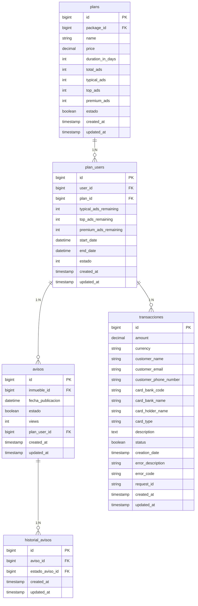

# Documento Técnico: Pago para Propietarios, Acreedores y Corredores

## 1. Resumen
**Descripción:** Este documento técnico describe la implementación del flujo de pago para propietarios, acreedores y corredores en la plataforma **Puja Inmobiliaria**. Incluye la interacción con el sistema OpenPay para procesar pagos con tarjeta de crédito/débito y las operaciones relacionadas, como la gestión de planes y publicación de avisos.

**Propósito:** Documentar la lógica del sistema de pago, incluyendo vistas, controladores, rutas y la relación con OpenPay, para facilitar su mantenimiento y escalabilidad.

---

## 2. Requisitos Funcionales Relacionados
- **RF002:** Permitir a los usuarios contratar un plan de visibilidad para sus avisos.
- **RF003:** Permitir pagos mediante tarjeta de crédito o débito utilizando OpenPay.
- **RF004:** Registrar transacciones de pago y asociarlas a usuarios y planes seleccionados.

---

## 3. Base de Datos Relacionada
### Tablas Implicadas

#### **Tabla: `plans`**
- **Funcionalidad:**  
  La tabla `plans` almacena información sobre los planes disponibles para los usuarios, que definen la cantidad de avisos, duración y características de visibilidad.  
- **Relaciones:**  
  - **Con `avisos`:** Un plan puede ser asociado a varios avisos a través de la relación con la tabla `plan_user`, lo que permite que los usuarios publiquen inmuebles en la plataforma bajo un plan específico.
  - **Con `transacciones`:** Registra las transacciones realizadas para adquirir un plan.

**Estructura:**
| **Columna**         | **Tipo**     | **Descripción**                                               |
|----------------------|--------------|---------------------------------------------------------------|
| `id`                | BIGINT       | Identificador único del plan.                                |
| `package_id`        | BIGINT       | Relación con la tabla `packages`.                            |
| `name`              | VARCHAR(255) | Nombre del plan.                                              |
| `price`             | DECIMAL      | Precio del plan.                                              |
| `duration_in_days`  | INT          | Duración en días del plan.                                    |
| `total_ads`         | INT          | Cantidad total de avisos permitidos por el plan.              |
| `typical_ads`       | INT          | Cantidad de avisos típicos permitidos.                        |
| `top_ads`           | INT          | Cantidad de avisos top permitidos.                            |
| `premium_ads`       | INT          | Cantidad de avisos premium permitidos.                        |
| `estado`            | BOOLEAN      | Estado del plan (activo/inactivo).                            |
| `created_at`        | TIMESTAMP    | Fecha de creación del registro.                               |
| `updated_at`        | TIMESTAMP    | Fecha de última actualización del registro.                   |

---

#### **Tabla: `avisos`**
- **Funcionalidad:**  
  La tabla `avisos` registra los inmuebles que los usuarios publican en la plataforma, permitiendo almacenar información como fecha de publicación, estado, y cantidad de visualizaciones.  
- **Relaciones:**  
  - **Con `inmuebles`:** Cada aviso está asociado a un inmueble específico.
  - **Con `historial_avisos`:** Lleva un registro de los estados por los que ha pasado el aviso.
  - **Con `plan_user`:** Relaciona los avisos con el plan que les da visibilidad en la plataforma.

**Estructura:**
| **Columna**         | **Tipo**     | **Descripción**                                               |
|----------------------|--------------|---------------------------------------------------------------|
| `id`                | BIGINT       | Identificador único del aviso.                               |
| `inmueble_id`       | BIGINT       | Relación con la tabla `inmuebles`.                           |
| `fecha_publicacion` | DATETIME     | Fecha y hora de publicación del aviso.                       |
| `estado`            | BOOLEAN      | Estado del aviso (activo/inactivo).                          |
| `views`             | INT          | Cantidad de visualizaciones del aviso.                       |
| `created_at`        | TIMESTAMP    | Fecha de creación del registro.                              |
| `updated_at`        | TIMESTAMP    | Fecha de última actualización del registro.                  |

---

#### **Tabla: `historial_avisos`**
- **Funcionalidad:**  
  Esta tabla lleva un registro histórico de los cambios en el estado de los avisos. Cada vez que un aviso cambia de estado (por ejemplo, de "inactivo" a "publicado"), se crea un nuevo registro.  
- **Relaciones:**  
  - **Con `avisos`:** Cada entrada en el historial pertenece a un aviso específico.
  - **Con `estados_avisos`:** Almacena el estado del aviso en el momento del cambio.

**Estructura:**
| **Columna**         | **Tipo**     | **Descripción**                                               |
|----------------------|--------------|---------------------------------------------------------------|
| `id`                | BIGINT       | Identificador único del historial.                           |
| `aviso_id`          | BIGINT       | Relación con la tabla `avisos`.                              |
| `estado_aviso_id`   | BIGINT       | Relación con la tabla `estados_avisos`.                      |
| `created_at`        | TIMESTAMP    | Fecha de creación del registro.                              |
| `updated_at`        | TIMESTAMP    | Fecha de última actualización del registro.                  |

---

#### **Tabla: `transacciones`**
- **Funcionalidad:**  
  La tabla `transacciones` registra los pagos realizados por los usuarios al adquirir planes o servicios. Contiene detalles sobre el cliente, el método de pago y el estado de la transacción.  
- **Relaciones:**  
  - **Con `plans`:** Relaciona una transacción con el plan adquirido.
  - **Con usuarios:** A través de un cliente, asocia las transacciones a un usuario.

**Estructura:**
| **Columna**           | **Tipo**     | **Descripción**                                              |
|------------------------|--------------|--------------------------------------------------------------|
| `id`                  | BIGINT       | Identificador único de la transacción.                      |
| `amount`              | DECIMAL      | Monto de la transacción.                                    |
| `currency`            | VARCHAR(10)  | Moneda utilizada en la transacción.                         |
| `customer_name`       | VARCHAR(255) | Nombre del cliente que realizó la transacción.              |
| `customer_email`      | VARCHAR(255) | Correo electrónico del cliente.                             |
| `customer_phone_number`| VARCHAR(255)| Número de teléfono del cliente.                             |
| `card_bank_code`      | VARCHAR(255) | Código del banco de la tarjeta utilizada.                   |
| `card_bank_name`      | VARCHAR(255) | Nombre del banco de la tarjeta utilizada.                   |
| `card_holder_name`    | VARCHAR(255) | Nombre del titular de la tarjeta.                           |
| `card_type`           | VARCHAR(255) | Tipo de tarjeta (débito/crédito).                           |
| `description`         | TEXT         | Descripción del plan adquirido.                             |
| `status`              | BOOLEAN      | Estado de la transacción (0: fallida, 1: exitosa).          |
| `creation_date`       | TIMESTAMP    | Fecha de la transacción.                                    |
| `error_description`   | VARCHAR(255) | Descripción del error, en caso de fallo.                    |
| `error_code`          | VARCHAR(255) | Código del error, en caso de fallo.                         |
| `request_id`          | VARCHAR(255) | ID de la solicitud a OpenPay.                               |
| `created_at`          | TIMESTAMP    | Fecha de creación del registro.                             |
| `updated_at`          | TIMESTAMP    | Fecha de última actualización del registro.                 |

---

## 4. Relación de Tablas


---

## 5. Rutas Relacionadas
| **Ruta**               | **Método** | **Controlador**        | **Descripción**                                        |
|-------------------------|------------|------------------------|--------------------------------------------------------|
| `/pagar-openpay`        | POST       | `PlanController`       | Procesa el pago utilizando OpenPay.                   |
| `/contratar_plan`       | POST       | `PlanController`       | Asocia un aviso a un plan y registra la transacción.  |
| `/get-data-openpay`     | POST       | `PlanController`       | Proporciona las credenciales de OpenPay.              |

---

# 6. Métodos del Controlador

## **Controlador:** `PlanController.php`
**Ruta:** `/app/Http/Controllers/PlanController.php`

---

### **Método: `pay_openpay`**
- **Ruta:** `/pagar-openpay`
- **Descripción:** Este método interactúa con OpenPay para procesar los pagos realizados por los usuarios. Se encarga de enviar los datos de la transacción al sistema de pagos externo y devolver la respuesta correspondiente al frontend.

#### **Detalles Técnicos**
1. **Entradas:**
   - Datos enviados desde el frontend como:
     - `source_id`: Token generado por OpenPay para identificar la tarjeta de crédito/débito.
     - `amount`: Monto del pago.
     - `description`: Descripción del plan adquirido.
     - Información del cliente (nombre, correo, teléfono).
   - Estos datos se envían en formato JSON.

2. **Flujo de Trabajo:**
   1. **Obtención de Credenciales:**
      - El método recupera las credenciales configuradas en el archivo `.env`:
        - `OPENPAY_URL`: URL base de OpenPay.
        - `OPENPAY_ID`: Identificador único de la cuenta OpenPay.
        - `OPENPAY_SK`: Clave secreta de OpenPay.
   2. **Generación del Token de Autenticación:**
      - Se genera un token Base64 con las credenciales de OpenPay para autenticarse en el servicio.
   3. **Solicitud al API de OpenPay:**
      - Realiza una llamada HTTP POST al endpoint `/charges` de OpenPay, enviando los datos del pago en formato JSON.
   4. **Recepción y Manejo de Respuesta:**
      - OpenPay responde con un objeto JSON que incluye el estado del pago, detalles de la transacción y errores (si los hay).
   5. **Devolución de la Respuesta al Frontend:**
      - La respuesta de OpenPay se retorna al cliente para informar si el pago fue exitoso o fallido.

3. **Salidas:**
   - Objeto JSON con los datos de la respuesta de OpenPay:
     - Si el pago es exitoso:
       - Estado de la transacción (`status`).
       - Información del banco (`card_bank_name`, `card_bank_code`).
       - Tipo de tarjeta (`card_type`).
     - Si el pago falla:
       - Descripción del error (`error_description`).
       - Código del error (`error_code`).

#### **Interacción con el Frontend**
- **Desde el Modal de Pago (`pay-modal`):**
  1. Los datos de la tarjeta se envían al API de OpenPay desde el frontend para generar un token seguro (`source_id`).
  2. Este token y los datos del cliente se envían al backend a través del método `pay_openpay`.
  3. La respuesta del método se utiliza para mostrar mensajes de éxito o error en el frontend.

---

### **Método: `post_ad`**
- **Ruta:** `/contratar_plan`
- **Descripción:** Este método gestiona la asociación de un aviso a un plan contratado por el usuario. Valida la disponibilidad del plan, publica el aviso y actualiza el historial de avisos.

#### **Detalles Técnicos**
1. **Entradas:**
   - Parámetros enviados desde el frontend:
     - `plan_id`: Identificador del plan.
     - `aviso_id`: Identificador del aviso.
     - `tipo_aviso`: Tipo de aviso (típico, top, premium).
     - `plan_user_id`: (Opcional) Identificador de un plan ya existente asociado al usuario.

2. **Flujo de Trabajo:**
   1. **Validación de Datos:**
      - Se asegura que los parámetros requeridos sean válidos.
   2. **Verificación del Usuario:**
      - Comprueba si el usuario está autenticado.
   3. **Gestión del Plan:**
      - Si el plan no existe (`plan_user_id` no enviado):
        - Recupera los detalles del plan (`typical_ads`, `top_ads`, `premium_ads`) y los inicializa.
        - Calcula la duración del plan (`start_date`, `end_date`).
        - Crea un nuevo registro en la tabla `plan_users`.
      - Si el plan ya existe:
        - Recupera la información del plan asociado al usuario.
        - Verifica su estado (activo/inactivo) y su fecha de expiración.
   4. **Publicación del Aviso:**
      - Actualiza el tipo de aviso y la cantidad de avisos restantes en el plan.
      - Registra el cambio en la tabla `historial_avisos`.
   5. **Envío de Notificación:**
      - Envía un correo al usuario con los detalles del aviso publicado.

3. **Salidas:**
   - Respuesta JSON que incluye:
     - Estado de la operación (`status`).
     - Mensaje de éxito o error.
     - Identificador del `plan_user` actualizado.

#### **Interacción con el Frontend**
- **Desde el Modal de Pago (`pay-modal`):**
  - Una vez que el pago es exitoso, el frontend realiza una llamada al método `post_ad` para asociar el aviso al plan adquirido.
  - La respuesta de este método informa si la asociación fue exitosa y redirige al usuario a la página de gestión de avisos.

---

### **Método: `get_data_openpay`**
- **Ruta:** `/get-data-openpay`
- **Descripción:** Proporciona las credenciales necesarias para inicializar OpenPay en el frontend.

#### **Detalles Técnicos**
1. **Entradas:**
   - Este método no recibe parámetros del cliente.

2. **Flujo de Trabajo:**
   1. **Obtención de Credenciales:**
      - Recupera las credenciales de OpenPay desde el archivo `.env`:
        - `OPENPAY_ID`: Identificador único de la cuenta.
        - `OPENPAY_PK`: Clave pública utilizada para el frontend.
        - `OPENPAY_SANDBOX_MODE`: Modo de prueba o producción.
   2. **Validación:**
      - Verifica que las credenciales sean válidas y no estén vacías.
   3. **Respuesta:**
      - Devuelve las credenciales en formato JSON.

3. **Salidas:**
   - Objeto JSON con:
     - `openpay_id`: Identificador único.
     - `openpay_pk`: Clave pública.
     - `openpay_sb_mode`: Indicador del modo sandbox.

#### **Interacción con el Frontend**
- **Desde el Modal de Pago (`pay-modal`):**
  - El frontend llama a este método para obtener las credenciales de OpenPay y configurar la integración de pagos en el cliente.

---

### **Resumen de Interacciones con el Frontend**

1. **Flujo de Pago:**
   - El cliente selecciona un plan y proporciona los datos de su tarjeta en el modal.
   - El frontend utiliza `get_data_openpay` para configurar OpenPay.
   - Una vez configurado, genera un token seguro (`source_id`) y lo envía a través de `pay_openpay`.
   - Si el pago es exitoso, llama a `post_ad` para asociar el aviso al plan.

2. **Errores y Notificaciones:**
   - Los errores de OpenPay (como tarjeta rechazada) se manejan y se muestran en el frontend mediante `Toast`.
   - En caso de éxito, el usuario es redirigido a la página de gestión de avisos.

---

## 7. APIs y Detalles Técnicos

---

### **OpenPay**
La integración con OpenPay se utiliza para procesar los pagos con tarjeta de crédito y débito en la plataforma.

#### **Detalles Técnicos**
- **API Base URL:** Recuperada desde la variable de entorno `OPENPAY_URL`.
- **Autenticación:**
  - Clave pública y privada configuradas en las variables `OPENPAY_ID` y `OPENPAY_SK`.
  - Token de autorización codificado en formato Base64.
- **Operaciones Implementadas:**
  - **Crear un token de pago:** Se genera un token seguro que identifica la tarjeta sin exponer información sensible.
  - **Registrar la transacción:** Realiza el cargo al cliente con el token generado.

#### **Estructura de la Solicitud**
**Endpoint:** `/charges`  
**Método:** `POST`  
**Cuerpo de la solicitud:**
```json
{
  "source_id": "tok_test_123456789",
  "method": "card",
  "amount": 129.00,
  "currency": "PEN",
  "description": "Plan adquirido: Top - Vigencia: 30 días - Avisos: 1",
  "device_session_id": "ds_test_123456789",
  "customer": {
    "name": "John",
    "last_name": "Doe",
    "phone_number": "987654321",
    "email": "johndoe@example.com"
  }
}
```

#### **Estructura de la Respuesta**
- **Éxito:**
```json
{
  "status": "completed",
  "authorization": "123456",
  "operation_type": "in",
  "transaction_type": "charge",
  "card": {
    "type": "debit",
    "brand": "visa",
    "holder_name": "John Doe",
    "bank_name": "Banco Test",
    "bank_code": "12345"
  }
}
```

- **Error:**
```json
{
  "status": "failed",
  "error_code": "1004",
  "description": "La tarjeta fue rechazada.",
  "request_id": "req_test_123456789"
}
```

---

### **Fetch Requests**
Se utilizan en el frontend para interactuar con los endpoints del backend. Estas solicitudes están diseñadas para manejar las operaciones de pago y publicación.

---

#### **Endpoint:** `POST /pagar-openpay`
- **Descripción:** Procesa el pago del usuario utilizando OpenPay.
- **Entradas (Request Body):**
```json
{
  "source_id": "tok_test_123456789",
  "method": "card",
  "amount": 129.00,
  "currency": "PEN",
  "description": "Plan adquirido: Top - Vigencia: 30 días - Avisos: 1",
  "device_session_id": "ds_test_123456789",
  "customer": {
    "name": "John",
    "last_name": "Doe",
    "phone_number": "987654321",
    "email": "johndoe@example.com"
  }
}
```
- **Respuestas:**
  - **Éxito:**
  ```json
  {
    "status": "completed",
    "authorization": "123456",
    "transaction_id": "txn_123456789",
    "message": "Pago procesado exitosamente."
  }
  ```
  - **Error:**
  ```json
  {
    "status": "failed",
    "error_code": "1004",
    "message": "La tarjeta fue rechazada."
  }
  ```

---

#### **Endpoint:** `POST /contratar_plan`
- **Descripción:** Registra el plan adquirido por el usuario y publica el aviso.
- **Entradas (Request Body):**
```json
{
  "plan_id": 1,
  "tipo_aviso": 3,
  "aviso_id": 5,
  "plan_user_id": null
}
```
- **Respuestas:**
  - **Éxito:**
  ```json
  {
    "status": "success",
    "message": "Plan contratado exitosamente.",
    "plan_user_id": 10,
    "aviso": {
      "id": 5,
      "status": "publicado"
    }
  }
  ```
  - **Error:**
  ```json
  {
    "status": "error",
    "message": "El plan que deseas usar está caducado."
  }
  ```

---

#### **Endpoint:** `POST /get-data-openpay`
- **Descripción:** Recupera las credenciales necesarias para inicializar OpenPay en el frontend.
- **Entradas:** No requiere cuerpo de la solicitud.
- **Respuestas:**
  - **Éxito:**
  ```json
  {
    "status": "success",
    "openpay_id": "openpay_test_12345",
    "openpay_pk": "pk_test_67890",
    "openpay_sb_mode": true
  }
  ```
  - **Error:**
  ```json
  {
    "status": "error",
    "message": "Error al consultar la data de OpenPay."
  }
  ```

---

### **Interacción Completa**
1. **Obtener Credenciales (`/get-data-openpay`):**
   - El frontend llama a este endpoint para configurar OpenPay.
   - Las credenciales se utilizan para inicializar el SDK de OpenPay en el cliente.

2. **Procesar Pago (`/pagar-openpay`):**
   - Los datos de la tarjeta se envían a OpenPay a través del backend.
   - Se devuelve la respuesta del pago al frontend.

3. **Registrar Plan y Aviso (`/contratar_plan`):**
   - Una vez procesado el pago, el frontend registra el plan y publica el aviso.
   - Si el aviso es publicado correctamente, el frontend redirige al usuario a la página de gestión de avisos.

---

## 8. Vistas Relacionadas con el Pago

Este numeral describe las vistas y componentes Blade implicados en el flujo de pago para propietarios, acreedores y corredores.

---

### **8.1. Vistas de Selección de Planes**

#### **`planes.blade.php`**
- **Ubicación:** `resources/views/planes.blade.php`
- **Funcionalidad:**  
  Esta vista está orientada a los corredores y muestra los planes disponibles específicamente diseñados para ellos. Desde esta vista, los usuarios pueden seleccionar un plan que deseen contratar.
- **Estructura Principal:**
  - Listado de planes para corredores con sus características (precio, duración, cantidad de avisos permitidos).
  - Botón de acción para contratar el plan seleccionado, que abre el modal de pago (`pay-modal`).
- **Interacción con el Backend:**  
  Cuando se selecciona un plan, el frontend interactúa con los endpoints `/pagar-openpay` para procesar el pago y `/contratar_plan` para asociar el aviso al plan adquirido.

#### **`planes-acreedor.blade.php`**
- **Ubicación:** `resources/views/planes-acreedor.blade.php`
- **Funcionalidad:**  
  Similar a `planes.blade.php`, pero adaptada para los acreedores. Presenta planes específicos para este tipo de usuario.
- **Diferencias Principales:**
  - Personalización de la lista de planes según las necesidades de los acreedores.
  - Elementos adicionales para filtrar o clasificar los planes.

#### **`planes-propietario.blade.php`**
- **Ubicación:** `resources/views/planes-propietario.blade.php`
- **Funcionalidad:**  
  Muestra los planes orientados exclusivamente a los propietarios que desean publicar inmuebles.  
- **Diferencias Principales:**
  - Los planes mostrados están enfocados en la publicación de inmuebles y maximizar su visibilidad en la plataforma.

---

### **8.2. Componente Centralizado de Pago**

#### **`pay-modal.blade.php`**
- **Ubicación:** `resources/views/components/pay-modal.blade.php`
- **Funcionalidad:**  
  Este componente es el núcleo del sistema de pagos en el frontend. Se utiliza como modal emergente para que los usuarios ingresen los datos de su tarjeta y completen el proceso de pago.
- **Características Clave:**
  - Formulario para ingresar datos de la tarjeta:
    - Número de tarjeta.
    - Nombre del titular.
    - Fecha de vencimiento.
    - CVV.
  - Configuración dinámica con OpenPay:
    - Uso de credenciales obtenidas a través del endpoint `/get-data-openpay`.
    - Generación de un token seguro (`source_id`).
  - Manejo de eventos:
    - Envío de datos de pago al endpoint `/pagar-openpay`.
    - Llamada a `/contratar_plan` para asociar el plan una vez que el pago se realiza con éxito.
  - **Componentes de Interacción Visual:**
    - **Toasts** para notificaciones de éxito o error (ver sección `8.4. Notificaciones Toast`).
    - Segundo modal para seleccionar el documento de facturación (DNI o RUC).

- **Interacción con el Backend:**  
  - **Inicio del Pago:**
    1. Recupera las credenciales de OpenPay utilizando `/get-data-openpay`.
    2. Configura el SDK de OpenPay en el cliente.
  - **Procesamiento del Pago:**
    1. Envía los datos al endpoint `/pagar-openpay`.
    2. Maneja las respuestas del backend para notificar al usuario.
  - **Asociación del Aviso:**
    - Una vez procesado el pago, se llama al endpoint `/contratar_plan` para finalizar la publicación del aviso.

---

### **8.3. Flujo Completo desde el Frontend**

1. **Selección del Plan:**
   - El usuario selecciona un plan desde una de las vistas (`planes.blade.php`, `planes-acreedor.blade.php`, o `planes-propietario.blade.php`).
   - El sistema abre el modal de pago (`pay-modal.blade.php`).

2. **Ingreso de Datos de la Tarjeta:**
   - En el modal, el usuario ingresa los datos de su tarjeta.
   - OpenPay genera un token seguro (`source_id`) para evitar exponer datos sensibles.

3. **Procesamiento del Pago:**
   - Los datos se envían al backend mediante el endpoint `/pagar-openpay`.
   - Si el pago es exitoso, el backend responde con los detalles de la transacción.

4. **Publicación del Aviso:**
   - Se realiza una solicitud al endpoint `/contratar_plan` para asociar el aviso al plan adquirido.
   - Si el aviso es publicado correctamente, el usuario recibe una notificación y es redirigido a la página de gestión de avisos.

5. **Notificación al Usuario:**
   - **Éxito:** El sistema muestra un mensaje de confirmación mediante un Toast (ver sección `8.4. Notificaciones Toast`).
   - **Error:** Se notifica al usuario con el mensaje del error específico.

---

### **8.4. Notificaciones Toast**

El sistema utiliza notificaciones visuales mediante **Toasts** para informar al usuario sobre el resultado del pago.

#### **`triggerToastSuccess`**
- **Script Relacionado:** `resources/js/scripts/toastySuccess.js`
- **Funcionalidad:**  
  Muestra un Toast de éxito cuando el pago se procesa correctamente.
- **Código del Script:**
```javascript
import * as bootstrap from 'bootstrap';
const toastSuccess = document.getElementById('toastSuccess');
const toastBootstrapSuccess = bootstrap.Toast.getOrCreateInstance(toastSuccess);

function triggerToastSuccess() {
  toastBootstrapSuccess.show();
}

window.triggerToastSuccess = triggerToastSuccess;
```

#### **`triggerToastPayError`**
- **Script Relacionado:** `resources/js/scripts/toastyPayError.js`
- **Funcionalidad:**  
  Muestra un Toast de error cuando el pago falla.
- **Código del Script:**
```javascript
import * as bootstrap from 'bootstrap';
const toastPayError = document.getElementById('toastPayError');
const toastBootstrapPayError = bootstrap.Toast.getOrCreateInstance(toastPayError);

function triggerToastPayError() {
  toastBootstrapPayError.show();
}

window.triggerToastPayError = triggerToastPayError;
```

#### **Eventos en `pay-modal.blade.php`:**
- **Invocación del Toast de Éxito:**
```javascript
triggerToastSuccess();
```

- **Invocación del Toast de Error:**
```javascript
triggerToastPayError();
```

---

### **8.5. Código Relacionado**

#### **Ejemplo de Uso en `planes.blade.php`:**
```html
@component('components.pay-modal', [
  'avisoId' => $aviso->id,
  'userName' => Auth::user()->name,
  'userSurname' => Auth::user()->surname,
  'userEmail' => Auth::user()->email,
  'userPhone' => Auth::user()->phone,
  'userTypeId' => Auth::user()->type_id
])
@endcomponent
```

---

## 9. Referencias a la Documentación de OpenPay

Para mayor información sobre la integración y configuración de OpenPay, consulta los siguientes recursos oficiales:

- **Guía de Pagos con Tarjeta (México):**  
  [https://documents.openpay.mx/docs/card-charge.html](https://documents.openpay.mx/docs/card-charge.html)

- **Documentación General de Pagos con Tarjeta (Perú):**  
  [https://documents.openpay.pe/documentacion/pagos-con-tarjeta/](https://documents.openpay.pe/documentacion/pagos-con-tarjeta/)

---

## 10. Historial de Cambios
| **Versión** | **Fecha**       | **Cambios Realizados**           | **Autor**              |
|-------------|-----------------|-----------------------------------|------------------------|
| v1.0        | 06/12/2024      | Documento técnico inicial creado | Walker Alfaro          |