# Manual de Usuario - Publicar Inmueble como Acreedor

## 1. Introducción
Este manual guía a los usuarios con perfil **Acreedor** a través del proceso de publicación de inmuebles en remate en la plataforma **Puja Inmobiliaria**. La herramienta facilita la visibilidad de propiedades en remate, permitiendo a los acreedores contactar compradores potenciales de manera eficiente.

---

## 2. Requisitos
Antes de iniciar, asegúrate de cumplir con los siguientes requisitos:
1. Estar registrado como usuario **Acreedor** en la plataforma.
2. Tener información detallada del inmueble, como:
   - Tipo y subtipo de inmueble.
   - Ubicación (departamento, provincia y distrito).
   - Superficie (m²).
   - Antigüedad del inmueble.
   - Precio de remate y valor de tasación.
3. Contar con una imagen principal del inmueble.
4. Opcionalmente, tener imágenes adicionales y características extras.

---

## 3. Pasos para Publicar un Inmueble en Remate

### **Paso 1: Acceso al Módulo de Publicación**
1. Inicia sesión en la plataforma con tu perfil **Acreedor**.
2. En el menú principal, selecciona la opción **Publica Aquí**.

   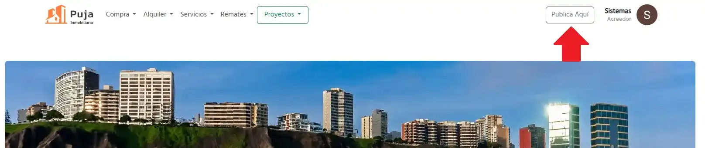

3. Dentro del módulo de publicación, selecciona la opción **Rematar**.

---

### **Paso 2: Registro del Inmueble**
1. Selecciona el **Tipo de Inmueble** y su **Subtipo** desde las listas desplegables.

   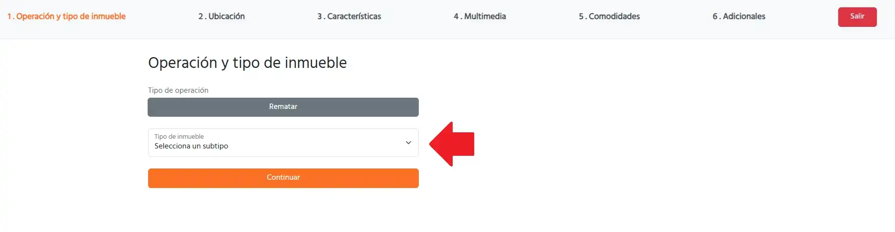

2. Completa los campos obligatorios de **ubicación**:
   - Departamento.
   - Provincia.
   - Distrito.

   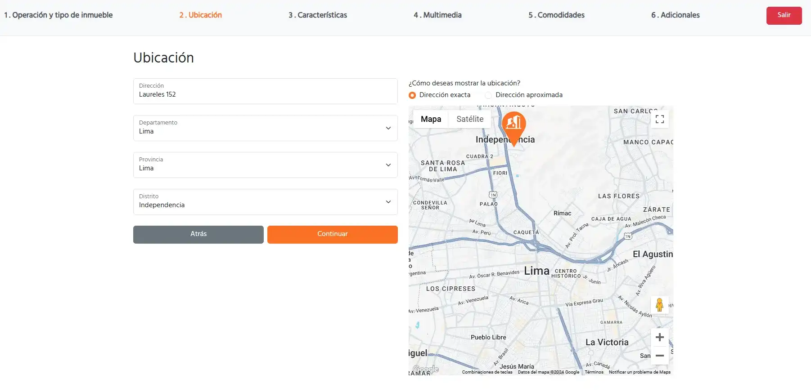

3. Ingresa las características principales del inmueble:
   - **Superficie** en metros cuadrados (m²).
   - **Antigüedad** en años.
   - **Precio de Remate** (en soles o dólares).
   - **Valor de Tasación** (en soles o dólares).

   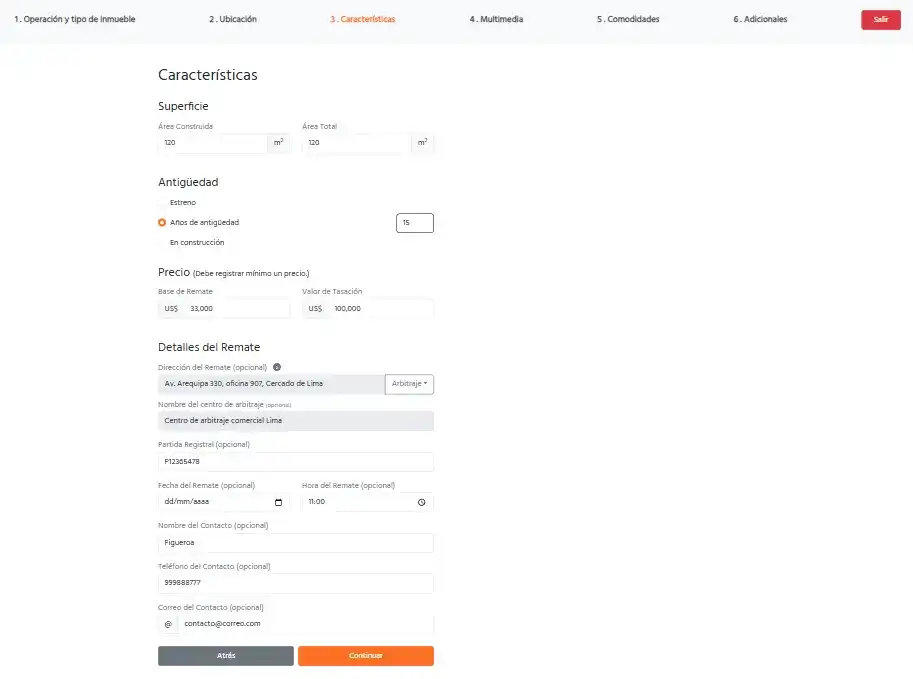
   
---

### **Paso 3: Gestión de Imágenes del Inmueble**
1. En la sección **Imágenes del Inmueble**, haz clic en **Seleccionar Archivo**.
2. Elige la **imagen principal** del inmueble desde tu computadora.
3. Opcionalmente, selecciona **imágenes adicionales** para brindar mayor detalle.

   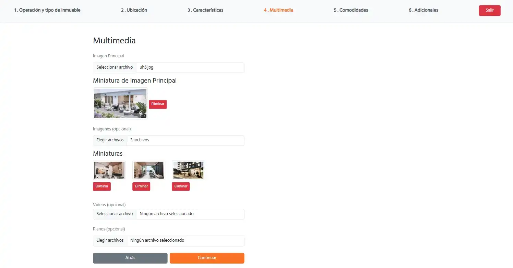

---

### **Paso 4: Selección de Características Adicionales**
1. Si aplica, selecciona las características adicionales disponibles.
2. Estas opciones se encuentran en la sección **Adicionales
   
   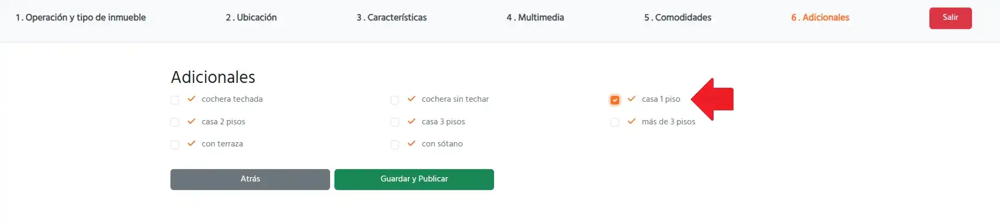

---

### **Paso 5: Publicación del Inmueble**
1. Una vez completados todos los campos, haz clic en el botón **Guardar y Publicar**.
   
   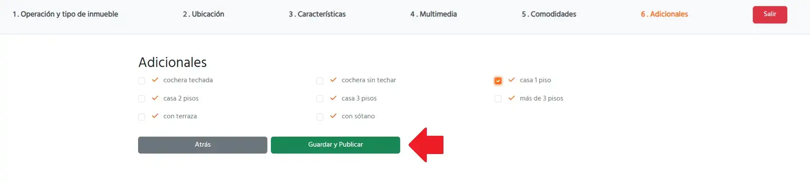

2. Si los datos son correctos, el sistema mostrará un mensaje de éxito y redirigirá a la página del inmueble pre-publicado (borrador).
   
   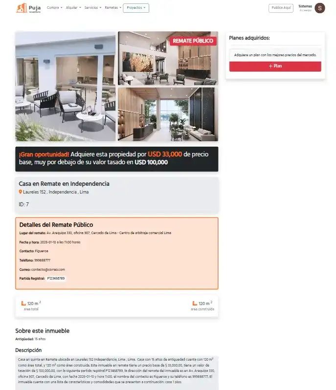

---

### **Paso 6: Adquisición de un Plan de Visibilidad**
1. En la página del inmueble publicado, haz clic en el botón **+ Plan**.
   
   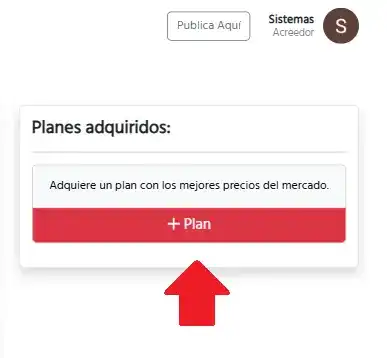

2. Selecciona la **duración del remate**:
   - 7 días.
   - 15 días.
3. Elige el tipo de plan:
   - **Estándar**.
   - **Top**.
   - **Premium**.
   
   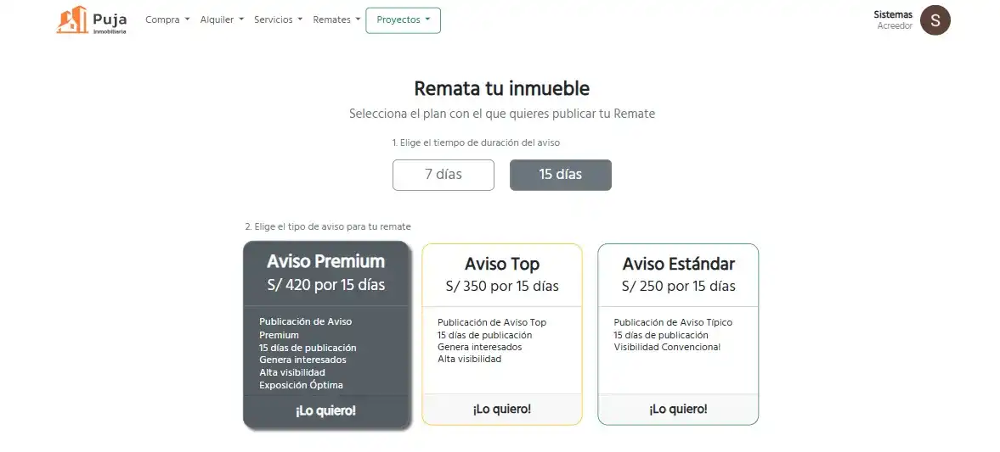

4. Realiza el **pago** a través de la pasarela de pago.
   
   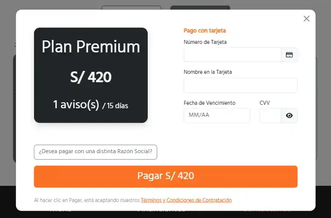

5. Al finalizar, el inmueble se destacará en la plataforma según el plan adquirido.
   
   

---

## 4. Flujos Opcionales
- **Editar el Inmueble:**  
  Después de publicar, puedes editar la descripción o características desde la sección de **Mis Publicaciones**.
   
   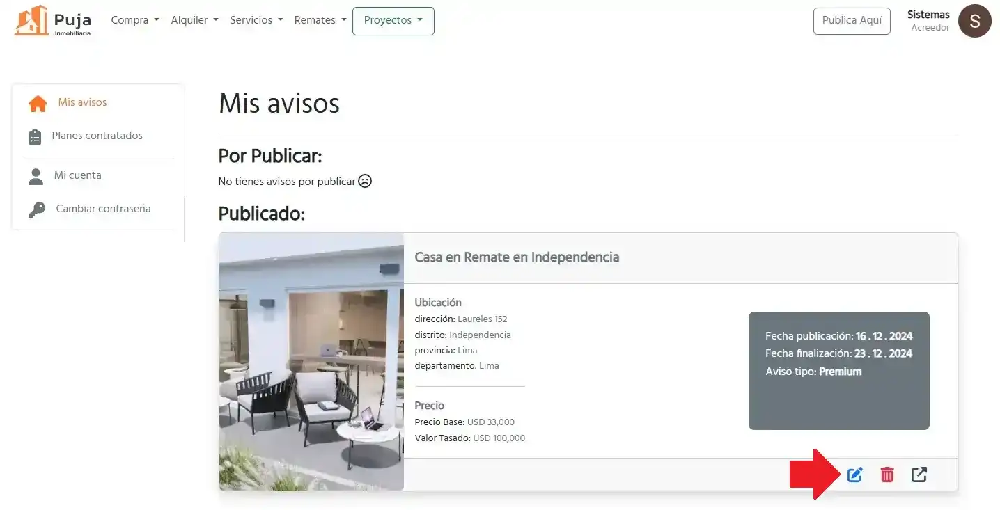

- **Agregar Imágenes Adicionales:**  
  Puedes volver a la sección de imágenes y subir más archivos.

---

## 5. Errores Comunes y Soluciones

### **Error 1: "Faltan campos obligatorios"**
- **Causa:** No se completaron todos los campos requeridos.
- **Solución:** Revisa los campos destacados en rojo e ingresa la información faltante.

### **Error 2: "No se puede subir imágenes"**
- **Causa:** La imagen excede el tamaño permitido o no es compatible.
- **Solución:** Verifica que las imágenes tengan formato `.jpg` o `.png` y que no excedan los **5 MB**.

### **Error 3: "No se puede seleccionar el distrito"**
- **Causa:** El departamento o la provincia no fueron seleccionados previamente.
- **Solución:** Asegúrate de elegir primero el departamento y luego la provincia antes de intentar seleccionar el distrito.

---

## 6. Preguntas Frecuentes (FAQ)
**1. ¿Qué sucede si olvido agregar la imagen principal?**  
El sistema no permitirá publicar el inmueble hasta que subas una imagen principal.

**2. ¿Puedo cambiar el precio del remate después de publicar?**  
Sí, puedes editar los detalles del inmueble desde la sección de **Mis Publicaciones**.

**3. ¿Cómo puedo destacar mi inmueble en la plataforma?**  
Puedes adquirir un plan de visibilidad seleccionando el botón **+ Plan** en la página del inmueble.

---

## 7. Contacto para Soporte Técnico
Si tienes problemas durante la publicación, contacta con nuestro equipo de soporte:
- **Correo Electrónico:** soporte@pujainmobiliaria.com.pe  
- **Teléfono:** +51 123 456 789  
- **Horario de Atención:** Lunes a viernes, de 9:00 a 18:00.

---

## 8. Glosario
- **Remate:** Proceso de venta pública de un inmueble a un precio base definido.
- **Valor de Tasación:** Estimación oficial del valor del inmueble.
- **Superficie:** Área total del inmueble en metros cuadrados.

---

¡Con este manual, podrás publicar tus inmuebles en remate de manera efectiva en **Puja Inmobiliaria**! Si tienes dudas adicionales, no dudes en consultar el soporte técnico.
