# Manual de Usuario - Publicar Post

## 1. Introducción
Este manual guía a los administradores a través del proceso de publicación de un **Post** para el **Blog** en el panel administrador. Los posts son entradas de blog utilizadas para compartir contenido en la plataforma **Puja Inmobiliaria**.

---

## 2. Requisitos
Antes de comenzar, asegúrate de cumplir con los siguientes requisitos:
1. Tener acceso al panel administrador con permisos de administrador.
2. Contar con:
   - Un título para el post.
   - El contenido o cuerpo del post.
   - Una imagen principal (obligatoria).
   - Opcional: Imágenes para el cuerpo del contenido.

---

## 3. Pasos para Publicar un Post

### Paso 1: Ingresar al Panel Administrador
1. Accede al panel administrador utilizando tu usuario y contraseña.  
2. En el menú lateral izquierdo, busca y selecciona la opción **Posts**.

   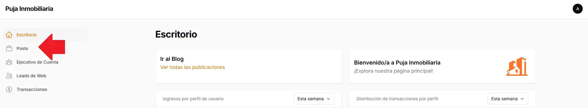

### Paso 2: Crear un Nuevo Post
1. Dentro de la página de **Posts**, haz clic en el botón **Crear Post** ubicado en la esquina superior derecha.
   
   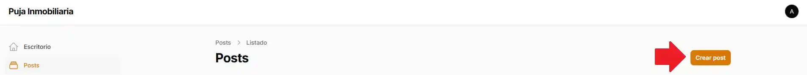

### Paso 3: Completar los Campos del Formulario
Se abrirá un editor de publicación con los siguientes campos obligatorios:

1. **Título del Post**  
   Ingresa el título del post en el campo correspondiente. El sistema generará automáticamente un **slug** basado en el título.
   
   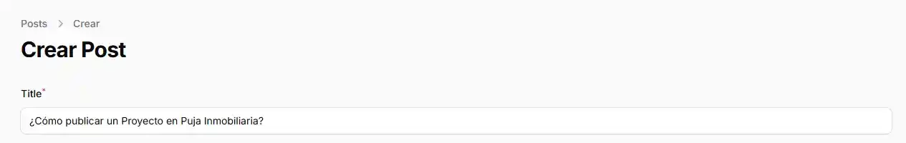

2. **Contenido o Cuerpo del Post**  
   El contenido se edita utilizando el editor WYSIWYG **Tiptap**. El editor permite:
   - Aplicar formato al texto (negrita, cursiva, listas, enlaces, etc.).
   - Insertar imágenes y otros elementos multimedia.

   - **Cómo insertar imágenes en el cuerpo del post:**
      - Haz clic en el botón **Media** dentro de la barra de herramientas del editor.
      - Selecciona una imagen desde tu computadora y cárgala al servidor.

   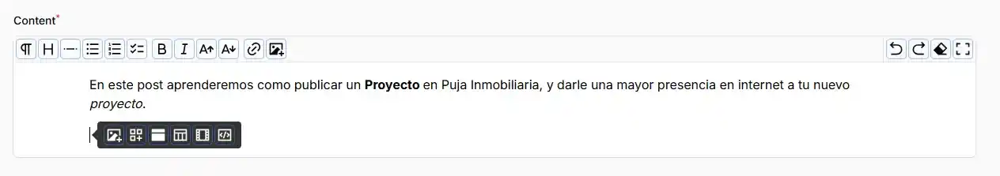

3. **Imagen Principal del Post**  
   - En la sección **Imagen Principal**, selecciona un archivo desde tu computadora.
   
      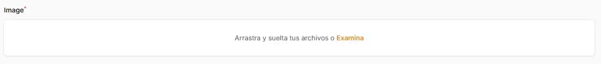

   - La imagen debe cumplir con los siguientes formatos: **JPEG, PNG, WEBP o SVG**.
   - Puedes editar la imagen dando clic en el *lapiz*.

      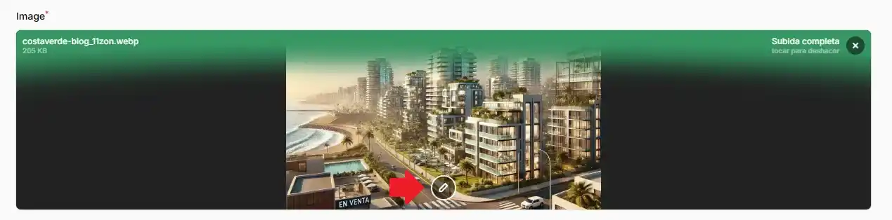

   - Opcionalmente, puedes utilizar la herramienta de recorte para ajustar la imagen con las proporciones **16:9**, **4:3** o **1:1**.

      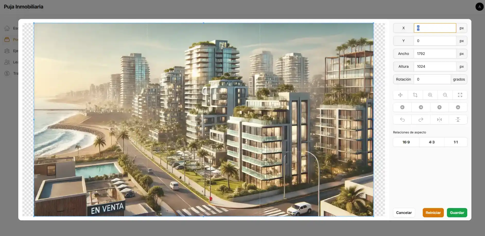

**[Imagen: Campo de carga de imagen principal con opciones de recorte disponibles.]**

### Paso 4: Guardar y Publicar el Post
1. Una vez completados todos los campos, haz clic en el botón **Crear** o **Crear y crear otro** ubicado en la parte inferior izquierda.
2. El sistema validará los datos y guardará el post en la base de datos.

   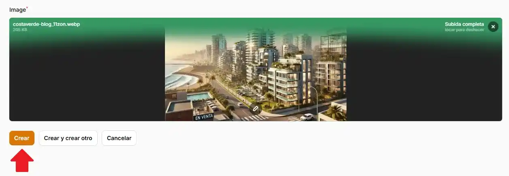

### Paso 5: Verificar el Post Publicado
1. Si el post se publicó correctamente, aparecerá en el listado de posts.

   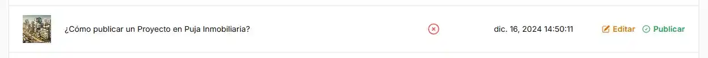

2. Puedes hacer clic en el widget ***Ir al Blog*** del panel administrador para ir a blog.

   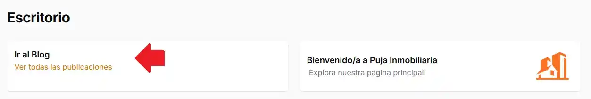

3. Verifica que el nuevo Post esté publicado

   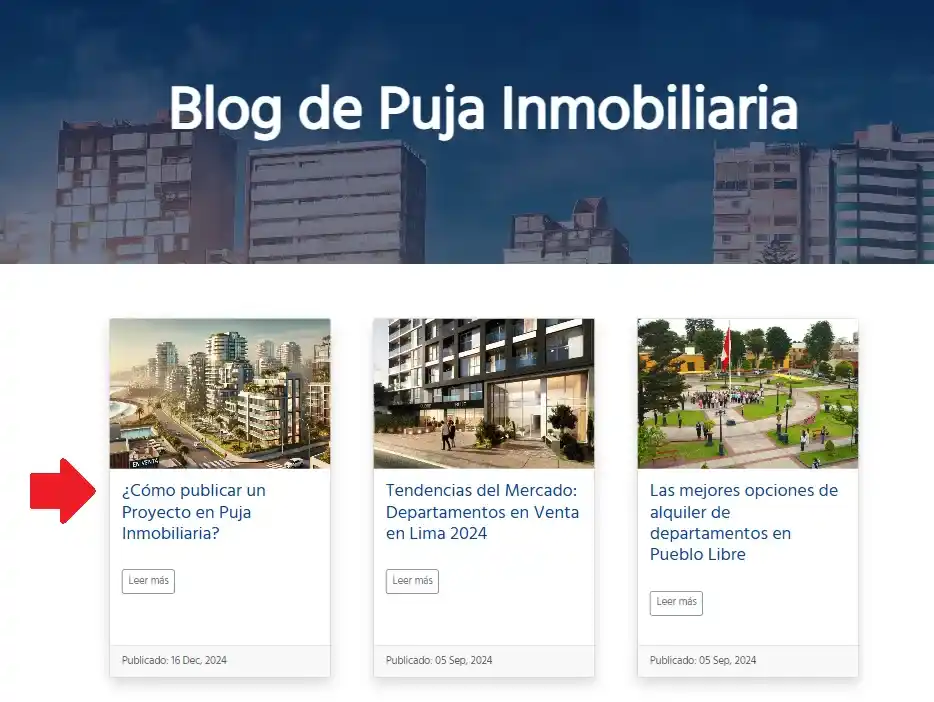

---

## 4. Opciones Adicionales

### Editar un Post Existente
1. En el listado de posts, haz clic en el botón **Editar** junto al post que deseas modificar.

   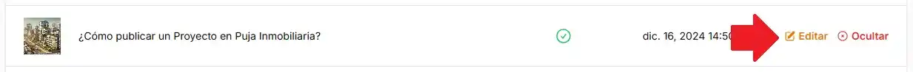

2. Realiza los cambios necesarios en el título, contenido o imagen principal.
3. Guarda los cambios haciendo clic en **Guardar**.

   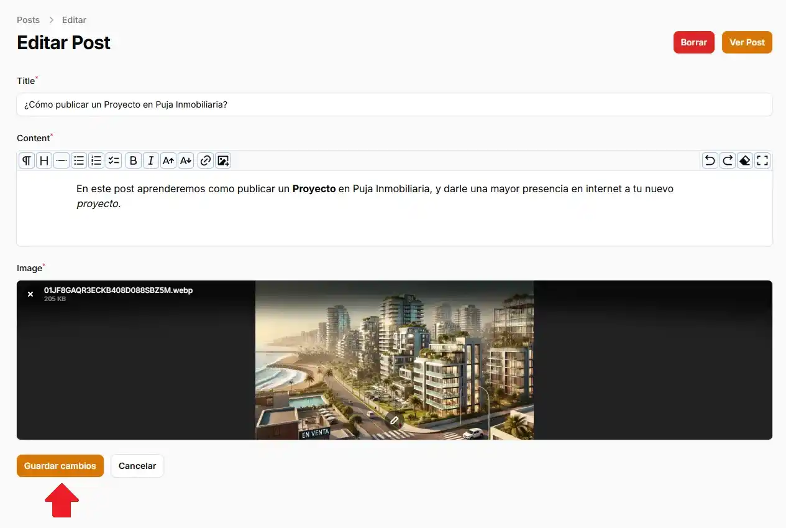

---

### Publicar/Ocultar un Post
1. En el listado de posts, cada entrada tiene una opción de **Publicar/Ocultar**.
2. Haz clic en el botón correspondiente para cambiar el estado del post:
   - **Publicar:** El post será visible en el blog.
   - **Ocultar:** El post será retirado del sitio público.

   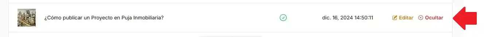

---

## 5. Errores Comunes y Soluciones

### Error 1: "Imagen Principal no Subida"
- **Causa:** La imagen principal es obligatoria.
- **Solución:** Verifica que hayas seleccionado una imagen válida y vuelve a cargarla.

### Error 2: "El Título o Contenido está Vacío"
- **Causa:** Los campos **Título** y **Contenido** son obligatorios.
- **Solución:** Revisa el formulario y completa los campos faltantes.

### Error 3: "La Imagen en el Editor No se Carga"
- **Causa:** La imagen puede no cumplir con los formatos aceptados.
- **Solución:** Verifica que el archivo sea **JPEG, PNG, WEBP o SVG** y que no exceda los **2 MB**.

---

## 6. Preguntas Frecuentes (FAQ)

**1. ¿Puedo insertar múltiples imágenes en el cuerpo del post?**  
Sí, el editor **Tiptap** permite cargar varias imágenes utilizando la opción **Media**.

**2. ¿Cómo puedo recortar la imagen principal?**  
Cuando subes la imagen principal, puedes elegir una de las proporciones predefinidas: **16:9**, **4:3** o **1:1**.

**3. ¿Qué ocurre si oculto un post?**  
El post dejará de ser visible en el sitio público, pero se mantendrá en el listado del panel administrador.

---

## 7. Contacto para Soporte Técnico
Si tienes problemas durante la publicación de un post, contacta con nuestro equipo de soporte:
- **Correo Electrónico:** soporte@pujainmobiliaria.com.pe  
- **Teléfono:** +51 123 456 789  
- **Horario de Atención:** Lunes a viernes, de 9:00 a 18:00.

---

## 8. Glosario
- **Post:** Entrada de blog publicada en la plataforma.
- **Slug:** URL amigable generada a partir del título del post.
- **Tiptap Editor:** Editor de texto WYSIWYG usado para gestionar el contenido de los posts.

