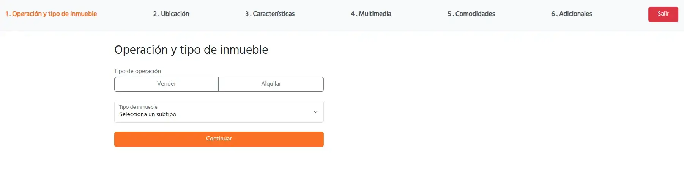
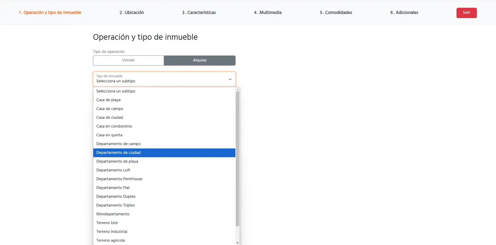
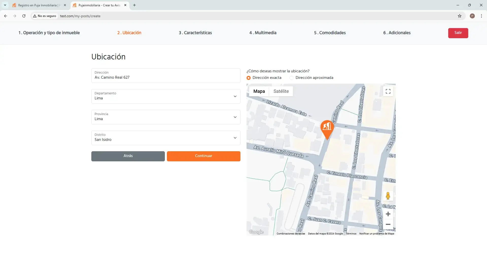
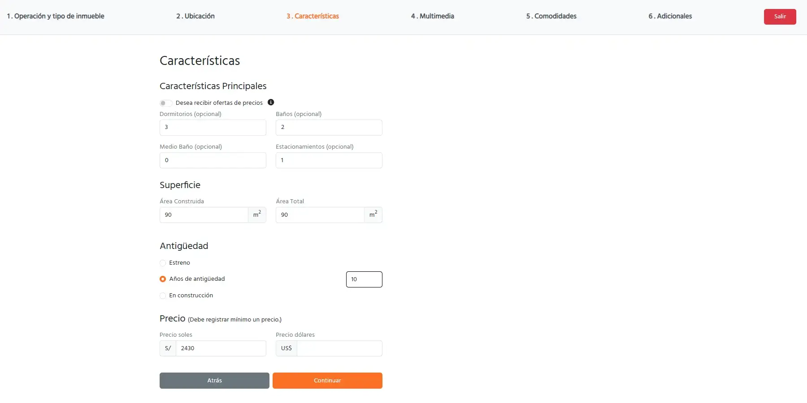
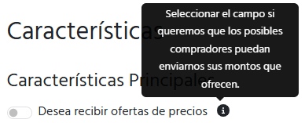
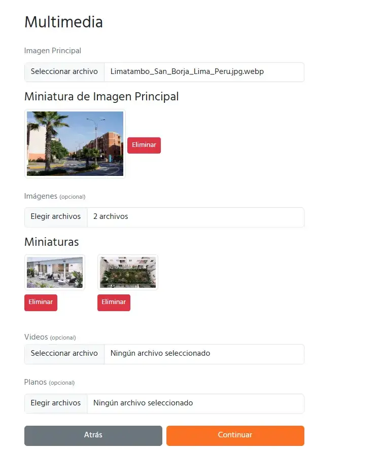
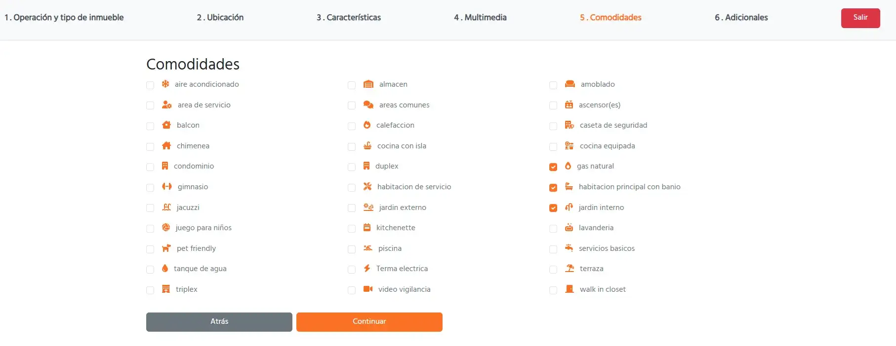
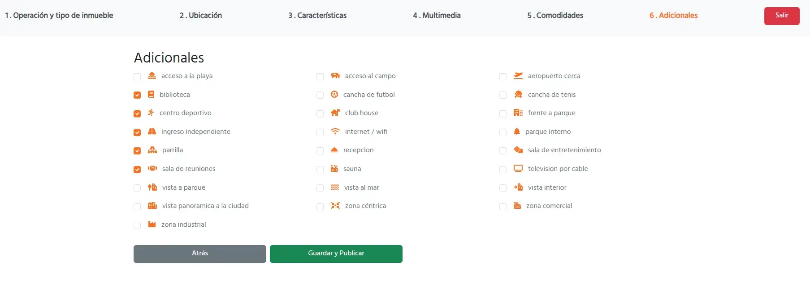
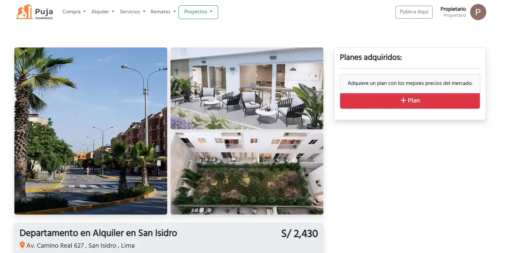
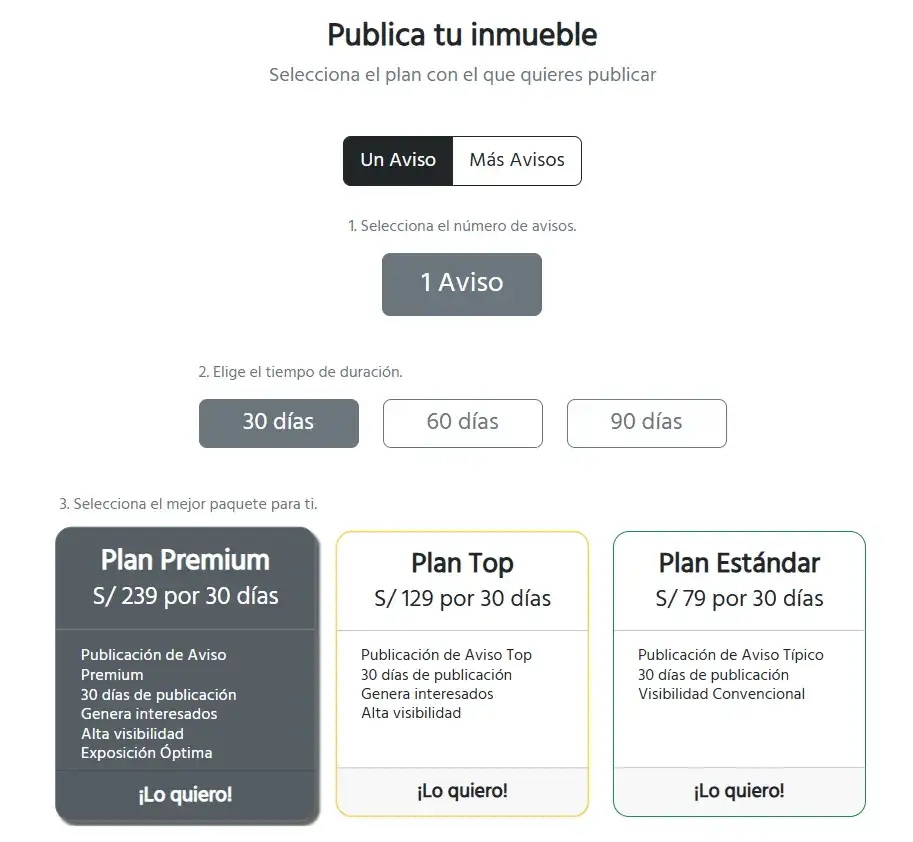

# Manual de Usuario - **Publicar Inmueble como Propietario**

## **1. Introducción**
Este manual tiene como objetivo guiarte paso a paso en el proceso de **Publicar un Inmueble como Propietario** en la plataforma **Puja Inmobiliaria**. A través de este flujo, podrás ingresar toda la información necesaria para que tu inmueble sea visible para potenciales compradores o arrendadores.

---

## **2. Requisitos**
Antes de publicar un inmueble, asegúrate de cumplir con los siguientes requisitos:
1. Contar con un perfil de usuario registrado como **propietario**.
2. Tener los siguientes datos del inmueble:
   - Tipo de operación (*venta* o *alquiler*).
   - Ubicación del inmueble.
   - Características generales (superficie, antigüedad, etc.).
   - Imagen principal del inmueble.
3. Opcional: Imágenes adicionales, comodidades y características adicionales.
4. Haber adquirido un plan de visibilidad (opcional para publicaciones estándar).

---

## **3. Pasos para Publicar un Inmueble**

### **Paso 1: Acceso al módulo de publicación**
1. Inicia sesión en la plataforma como usuario **propietario**.
2. Dirígete al módulo **Publica Aquí** desde el menú principal.

3. Selecciona la opción **Venta** o **Alquiler**.
4. Selecciona el subtipo de inmueble.

### **Paso 2: Ingreso de la ubicación**
1. Completa los campos relacionados con la ubicación del inmueble:
   - Dirección exacta.
   - Distrito, provincia y departamento.
   
2. Verifica que la ubicación sea precisa utilizando el mapa interactivo.

### **Paso 3: Características generales**
1. Especifica las siguientes características:
   - Número de dormitorios, baños y estacionamientos (opcionales).
   - Superficie en m².
   - Antigüedad del inmueble.
   

2. Ingresa los precios del inmueble:
   - Precio en soles o dólares (al menos uno es obligatorio).
   - Indica si el precio es negociable (opcional).

   

### **Paso 4: Subida de imágenes**
1. Sube la **imagen principal** del inmueble (obligatoria).
2. Agrega imágenes adicionales (opcional) arrastrando los archivos o seleccionándolos desde tu dispositivo.
3. Confirma la subida haciendo clic en el botón **Subir Imágenes**.

### **Paso 5: Comodidades y adicionales**
1. Selecciona las comodidades que ofrece el inmueble (piscina, ascensor, seguridad, etc.).

2. Marca los adicionales disponibles (depósito, amoblado, etc.).

### **Paso 6: Publicación del inmueble**
1. Haz clic en el botón **Guardar y Publicar**.
2. El sistema confirmará que la publicación ha sido exitosa y te redirigirá a la página del inmueble publicado.

### **Paso 7: Adquisición de un plan de visibilidad (opcional)**
1. Desde la página del inmueble publicado, haz clic en el botón **+ Plan**.

2. Selecciona el plan que prefieras:
   - **Estándar**: Publicación básica sin destaque.
   - **Top**: Publicación destacada con mayor visibilidad.
   - **Premium**: Máxima visibilidad en los resultados de búsqueda.
3. Realiza el pago siguiendo las instrucciones de la plataforma.
4. El inmueble se actualizará automáticamente con el nivel de visibilidad adquirido.

---

## **4. Flujos Opcionales**
- **Editar el inmueble**: Una vez publicado, puedes modificar la descripción, imágenes o características desde el módulo de edición.
- **Comprar un plan de visibilidad en otro momento**: Si no adquiriste un plan durante la publicación, puedes hacerlo desde la página del inmueble.

---

## **5. Errores Comunes y Soluciones**
### **Error 1: "Faltan campos obligatorios"**
- **Causa**: No completaste los campos obligatorios en algún paso.
- **Solución**: Revisa los campos marcados como obligatorios (*tipo de inmueble, ubicación, imagen principal, precio*).

### **Error 2: "No se puede subir la imagen"**
- **Causa**: El formato o tamaño del archivo no es compatible.
- **Solución**: Usa imágenes en formato `.jpg`, `.png` o `.webp`, y que no excedan los 5MB.

### **Error 3: "No se puede guardar el inmueble"**
- **Causa**: Hubo un problema en la conexión o en el servidor.
- **Solución**: Verifica tu conexión a internet y vuelve a intentarlo.

---

## **6. Preguntas Frecuentes (FAQ)**
### **¿Puedo publicar un inmueble sin imágenes adicionales?**
Sí, solo la imagen principal es obligatoria.

### **¿Puedo modificar la información después de publicar?**
Sí, puedes editar cualquier dato del inmueble desde el módulo de edición.

### **¿Es obligatorio adquirir un plan de visibilidad?**
No, pero los planes mejoran la visibilidad de tu inmueble en los resultados de búsqueda.

---

## **7. Contacto para Soporte Técnico**
Si tienes problemas durante la publicación, contacta con nuestro equipo de soporte:
- **Correo Electrónico:** soporte@pujainmobiliaria.com.pe
- **Teléfono:** +51 123 456 789
- **Horario de Atención:** Lunes a viernes, de 9:00 a 18:00.

---

## **8. Glosario**
- **Propietario**: Usuario registrado que publica inmuebles en la plataforma.
- **Imagen Principal**: Fotografía destacada que representa al inmueble en la plataforma.
- **Comodidades**: Características adicionales que incrementan el valor del inmueble.
- **Plan de Visibilidad**: Opciones de pago para mejorar la posición del inmueble en los resultados de búsqueda.

---

¡Con este manual, podrás publicar tus inmuebles de manera efectiva en **Puja Inmobiliaria**! Si tienes dudas adicionales, no dudes en consultar el soporte técnico.
