# Manual de Usuario - **Publicar Proyecto Inmobiliario**

## **1. Introducción**
Este manual tiene como objetivo guiarte paso a paso en el proceso de **Publicar un Proyecto Inmobiliario** en la plataforma **Puja Inmobiliaria**. Este módulo te permitirá gestionar la publicación de proyectos inmobiliarios con toda la información relevante, incluyendo unidades, imágenes, ubicación y detalles del progreso del proyecto.

---

## **2. Requisitos**
Antes de comenzar, asegúrate de cumplir con los siguientes requisitos:
1. Tener un perfil de usuario de tipo **proyecto**.
2. Contar con los siguientes datos del proyecto:
   - Nombre del proyecto.
   - Cantidad de unidades.
   - Banco financiador.
   - Progreso del proyecto.
   - Fecha de entrega.
   - Ubicación del proyecto.
3. Contar con las imágenes necesarias del proyecto y sus unidades.

---

## **3. Pasos para Publicar un Proyecto Inmobiliario**

### **Paso 1: Acceso al módulo de publicación**
1. Inicia sesión en la plataforma con tu perfil de tipo **proyecto**.
2. Dirígete al módulo **Publica Aquí** desde el menú principal.

### **Paso 2: Registro del proyecto**
1. Ingresa el **nombre del proyecto**.
2. Completa el campo **descripción** con información relevante sobre el proyecto.
3. Especifica la **cantidad de unidades** disponibles en el proyecto.
4. Selecciona el **banco financiador** del proyecto.
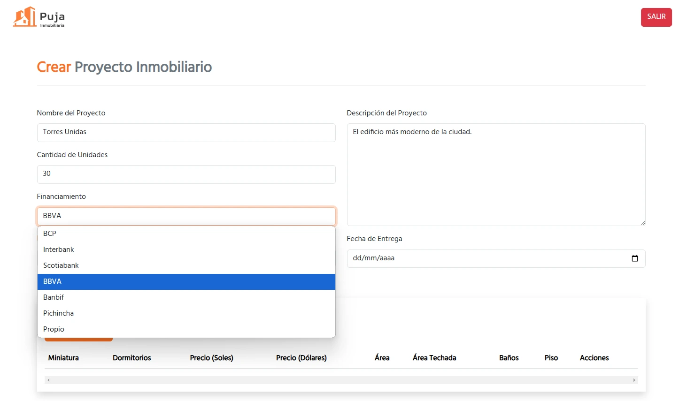
5. Indica el **progreso del proyecto** (por ejemplo, en planos, en construcción, entrega inmediata).
6. Ingresa la **fecha de entrega** esperada.
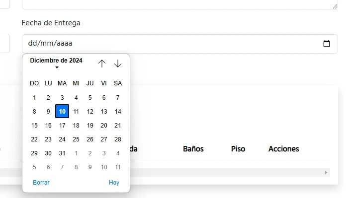
7. Completa los campos de **ubicación**, incluyendo:
   - Dirección.
   - Distrito, provincia y departamento.
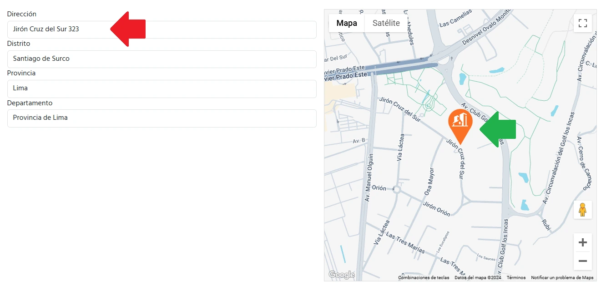

>La dirección, distrito, provincia y departamento se pueden autocompletar posicionando el **marker** encima de la ubicación en el mapa (flecha verde).

>Así mismo, se pueden autocompletar los campos de ubicación escribiendo la dirección en el campo *dirección* (flecha roja) y eligiendo de las opciones cual es la adecuada.
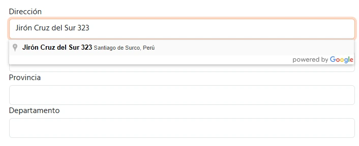
8. Haz clic en el botón **Guardar Parcialmente** para registrar la información.

   - **Guardar Parcialmente:** Guarda los cambios del Proyecto salir de página de creación.
   - **Guardar y Salir:** Guarda los cambios y redirige al usuario a la lista de proyectos publicados.
   - **Subir imágenes del Proyecto:** Sube las imágenes del Proyecto.

### **Paso 3: Gestión de imágenes del proyecto**
1. Después de guardar parcialmente, haz clic en el botón **Subir Imágenes del Proyecto**.
2. Selecciona o arrastra las imágenes correspondientes.
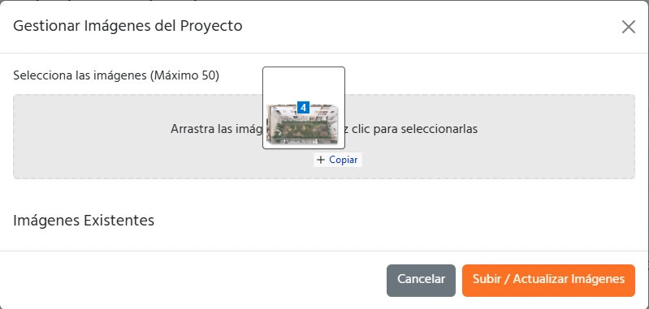
3. Haz clic en **Subir / Actualizar Imágenes**.
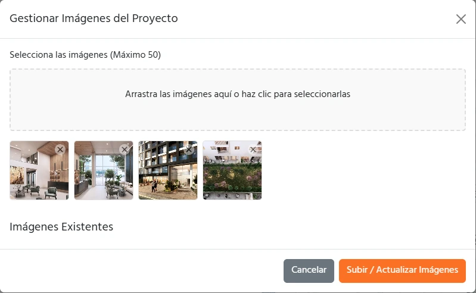

### **Paso 4: Gestión de unidades**
1. Haz clic en el botón **+ Agregar Unidad**.
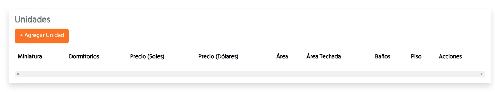
2. Completa los campos de cada unidad, incluyendo:
   - Tipo de unidad (departamento, oficina, etc.).
   - Tamaño en m².
   - Precio el soles (opcional en dólares).
   - Descripción.
   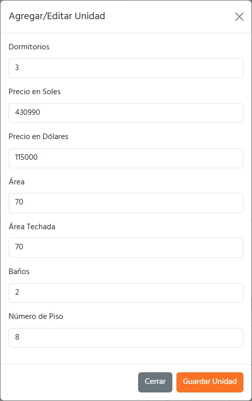
3. Haz clic en **Guardar Unidad**.

### **Paso 5: Gestión de imágenes de las unidades**
1. Una vez creadas las unidades, selecciona una de ellas.
2. Haz clic en el botón **Subir Plano**.
3. Selecciona o arrastra el archivo del plano correspondiente.
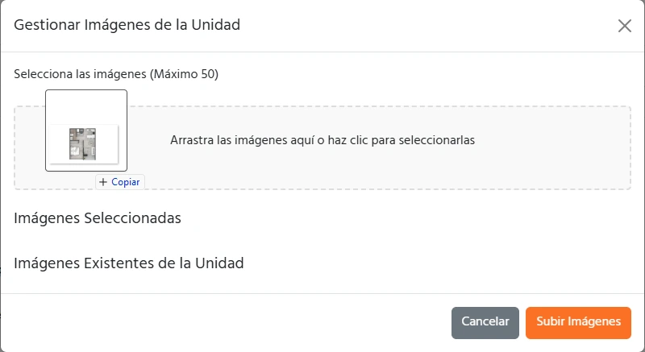
4. Haz clic en **Subir Imágenes**.
5. Las imágenes de la unidad quedaron subidas.
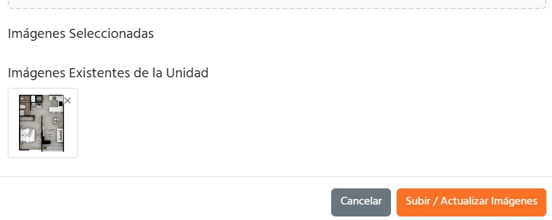

### **Paso 6: Selección de imagen principal**
1. Regresa al módulo de gestión de imágenes del proyecto presionando **Subir Imágenes del Proyecto**.
2. Selecciona la imagen principal marcando el checkbox correspondiente.
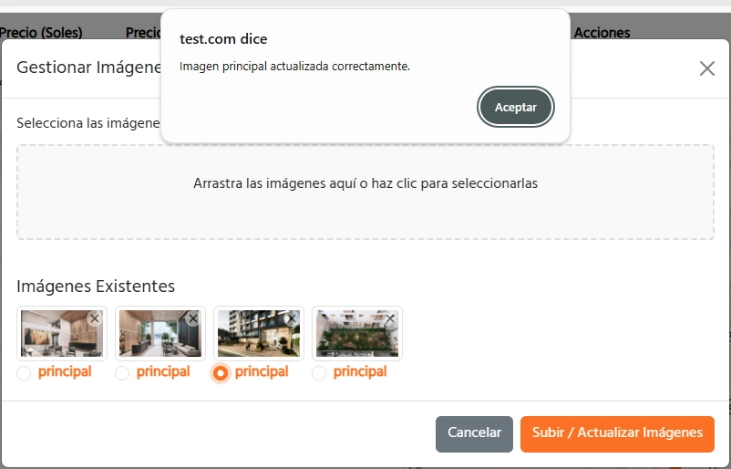
3. Haz clicl en **Aceptar** el alert que dice *Imagen principal actualizada corectamente.
3. Haz clic en **Guardar y Salir**.

---

## **4. Flujos Opcionales**
- **Actualizar información del proyecto**: Puedes regresar en cualquier momento al módulo de edición para actualizar detalles como descripción, cantidad de unidades o progreso.
- **Eliminar imágenes**: Desde el módulo de gestión de imágenes, puedes eliminar imágenes seleccionadas previamente.

---

## **5. Errores Comunes y Soluciones**
### **Error 1: "Faltan campos obligatorios"**
- **Causa**: No completaste los campos obligatorios del formulario.
- **Solución**: Verifica que los campos marcados como obligatorios (*nombre del proyecto, cantidad de unidades, banco financiador, progreso*) estén completos.

### **Error 2: "No se puede guardar la unidad"**
- **Causa**: Los campos obligatorios de la unidad no están completos.
- **Solución**: Asegúrate de completar todos los datos de la unidad antes de guardar.

### **Error 3: "No se pueden subir imágenes"**
- **Causa**: El formato o tamaño de la imagen no es compatible.
- **Solución**: Utiliza imágenes en formato `.jpg`, `.png` o `.webp`, y que no excedan el 1MB de tamaño.

---

## **6. Preguntas Frecuentes (FAQ)**
### **¿Puedo publicar un proyecto sin unidades?**
No, debes registrar al menos una unidad para poder publicar el proyecto.

### **¿Es obligatorio subir imágenes del proyecto?**
No es obligatorio, pero se recomienda para mejorar la visibilidad y atractivo del proyecto en la plataforma.

### **¿Puedo editar un proyecto después de publicarlo?**
Sí, puedes regresar al módulo de edición para actualizar cualquier información.

---

## **7. Contacto para Soporte Técnico**
Si tienes problemas durante la publicación, contacta con nuestro equipo de soporte:
- **Correo Electrónico:** soporte@pujainmobiliaria.com.pe
- **Teléfono:** +51 123 456 789
- **Horario de Atención:** Lunes a viernes, de 9:00 a 18:00.

---

## **8. Glosario**
- **Proyecto**: Conjunto de inmuebles en proceso de desarrollo o construcción.
- **Unidad**: Elemento individual dentro de un proyecto, como un departamento u oficina.
- **Progreso del Proyecto**: Estado actual del proyecto (en planos, en construcción, etc.).
- **Imagen Principal**: Fotografía destacada que representa el proyecto.

---

¡Con este manual, podrás publicar tus proyectos inmobiliarios de manera efectiva en **Puja Inmobiliaria**! Si tienes dudas adicionales, no dudes en consultar el soporte técnico.
