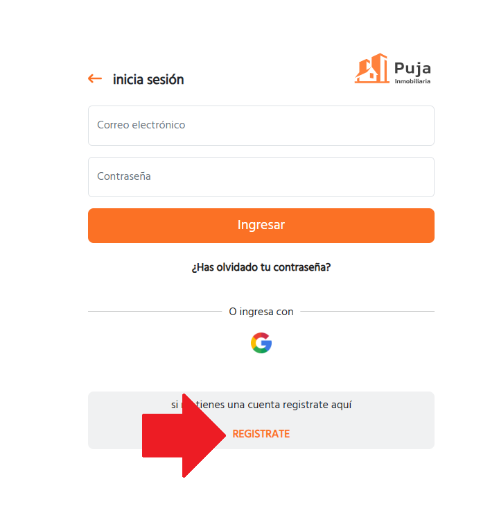
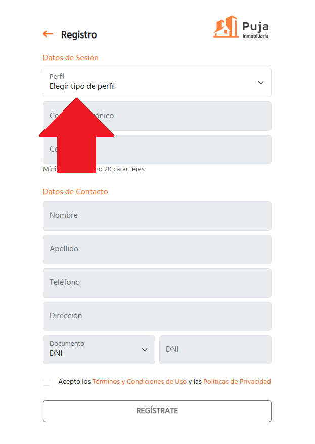
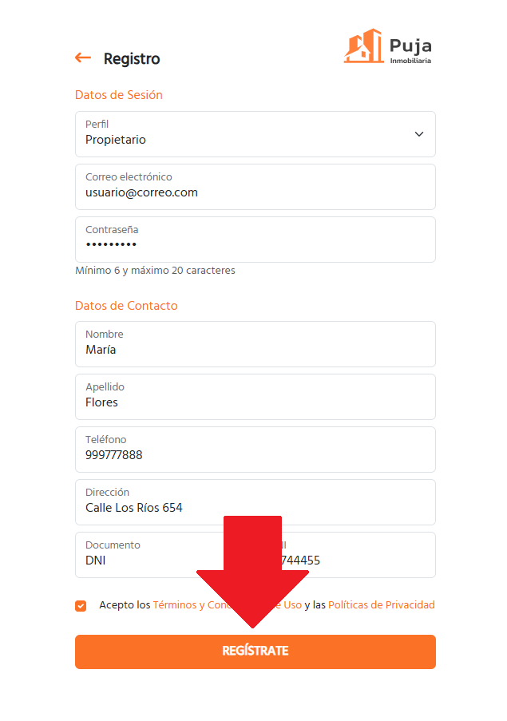
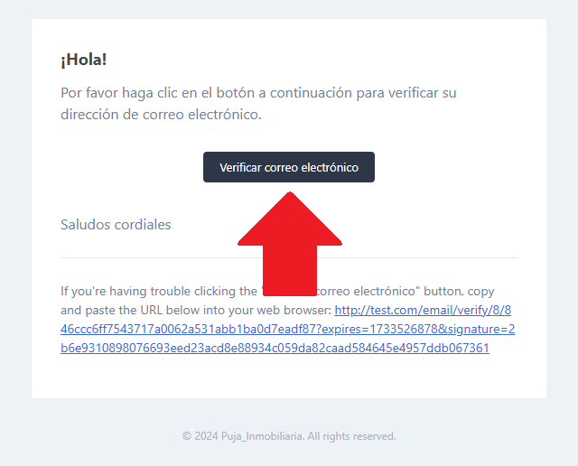
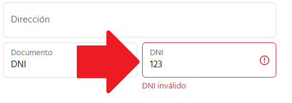
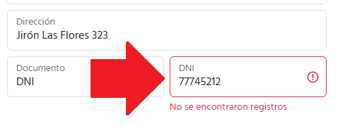

# Manual de Usuario - **Registro en Puja Inmobiliaria**

## **1. Introducción**
Este manual tiene como objetivo guiarte paso a paso en el proceso de **registro en Puja Inmobiliaria**. Completar este proceso te permitirá acceder a las funcionalidades de la plataforma, como la publicación y búsqueda de inmuebles, contacto con propietarios y muchas más.

---

## **2. Requisitos para Registrarse**
Antes de comenzar, asegúrate de cumplir con los siguientes requisitos:
1. Tener una dirección de correo electrónico válida.
2. Contar con acceso a internet y un navegador web actualizado.
3. Opcional: Una cuenta activa de Google si prefieres registrarte con esta opción.

---

## **3. Pasos para Registrarte**
### **Método 1: Registro con correo electrónico**
1. Ingresa al sitio web oficial: [https://www.pujainmobiliaria.com.pe](https://www.pujainmobiliaria.com.pe).
2. Haz clic en el botón **Iniciar Sesión** ubicado en la esquina superior derecha.

3. Selecciona la opción **Registrar**.

4. Completa el formulario de registro con la siguiente información:
   - **Nombre Completo**: Ingresa tus nombres y apellidos.
   - **Correo Electrónico**: Escribe una dirección de correo válida (obligatorio y único).
   - **Contraseña**: Crea una contraseña segura (entre 6 y 20 caracteres).
   - **Tipo de Documento**: Selecciona el tipo de documento (DNI, RUC, etc.).
   - **Número de Documento**: Ingresa el número de tu documento.
   - **Número de Teléfono**: Proporciona un número válido.
   - **Dirección**: Ingresa tu dirección completa.
   - **Aceptación de Términos y Políticas**: Marca las casillas de aceptación para continuar.

5. Haz clic en el botón **Regístrate**.

6. Recibirás un correo para confirmar la dirección de correo electrónico ingresada.

  - Si te registraste con correo electrónico, recibirás un correo de confirmación en la dirección proporcionada.

  - Abre el correo y haz clic en el enlace **Confirmar Cuenta**.

  - Serás redirigido al sitio y tu cuenta estará activada.

  

> **Nota:** Si no encuentras el correo en tu bandeja de entrada, revisa la carpeta de spam o correo no deseado.

7. Haciendo clic en el enlace del correo se confirma el correo electrónico y se inicia sesión automáticamente.

### **Método 2: Registro con Google**
1. En la misma página de registro, haz clic en el botón **Registrar con Google**.
2. Selecciona la cuenta de Google que deseas utilizar.
3. Autoriza a la plataforma a acceder a tu perfil básico (nombre y correo electrónico).
4. ¡Listo! Tu cuenta será creada automáticamente.

---

## **4. Confirmación del Registro**
### **Correo de Confirmación**
1. Si te registraste con correo electrónico, recibirás un correo de confirmación en la dirección proporcionada.
2. Abre el correo y haz clic en el enlace **Confirmar Cuenta**.
3. Serás redirigido al sitio y tu cuenta estará activada.

> **Nota:** Si no encuentras el correo en tu bandeja de entrada, revisa la carpeta de spam o correo no deseado.

---

## **5. Errores Comunes y Soluciones**
### **Error 1: "El correo ya está registrado"**
- Esto significa que ya existe una cuenta con ese correo electrónico.
- Solución: Intenta iniciar sesión o utiliza la opción **Recuperar Contraseña**.

### **Error 2: "DNI inválido"**
- Se verifica si el DNI ingresado es válido. En caso de no serlo:

- Solución: Ingresa un DNI válido.

### **Error 3: "DNI no existe"**
- Se verifica si el DNI ingresado existe. Caso contrario:

- Solución: Ingresa un DNI válido.

### **Error 3: No llega el correo de confirmación**
- Esto puede suceder si ingresaste un correo incorrecto o si el correo fue enviado a spam.
- Solución:
  1. Revisa tu carpeta de spam o correo no deseado.
  2. Si el problema persiste, intenta registrarte nuevamente con un correo válido.

---

## **6. Preguntas Frecuentes (FAQ)**
### **¿Es obligatorio confirmar mi cuenta?**
Sí, confirmar tu cuenta es necesario para acceder a todas las funcionalidades de la plataforma.

### **¿Puedo cambiar mi correo después de registrarme?**
No. Actualmente, el correo registrado es único y no se puede modificar. Si necesitas cambiarlo, deberás registrar una nueva cuenta.

---

## **7. Contacto para Soporte Técnico**
Si tienes problemas durante el registro, contacta con nuestro equipo de soporte:
- **Correo Electrónico:** soporte@pujainmobiliaria.com.pe
- **Teléfono:** +51 123 456 789
- **Horario de Atención:** Lunes a viernes, de 9:00 a 18:00.

---

## **8. Glosario**
- **Correo de Confirmación:** Correo electrónico enviado automáticamente después del registro para validar tu cuenta.
- **Contraseña Segura:** Contraseña que combina letras, números y símbolos, aumentando la seguridad de tu cuenta.

---

¡Con este manual, podrás completar tu registro en **Puja Inmobiliaria** de manera rápida y sencilla! Si tienes dudas adicionales, no dudes en consultar el soporte técnico.
